# VERL Partial Rollout - Charts and Diagrams

## 1. System Architecture Diagram

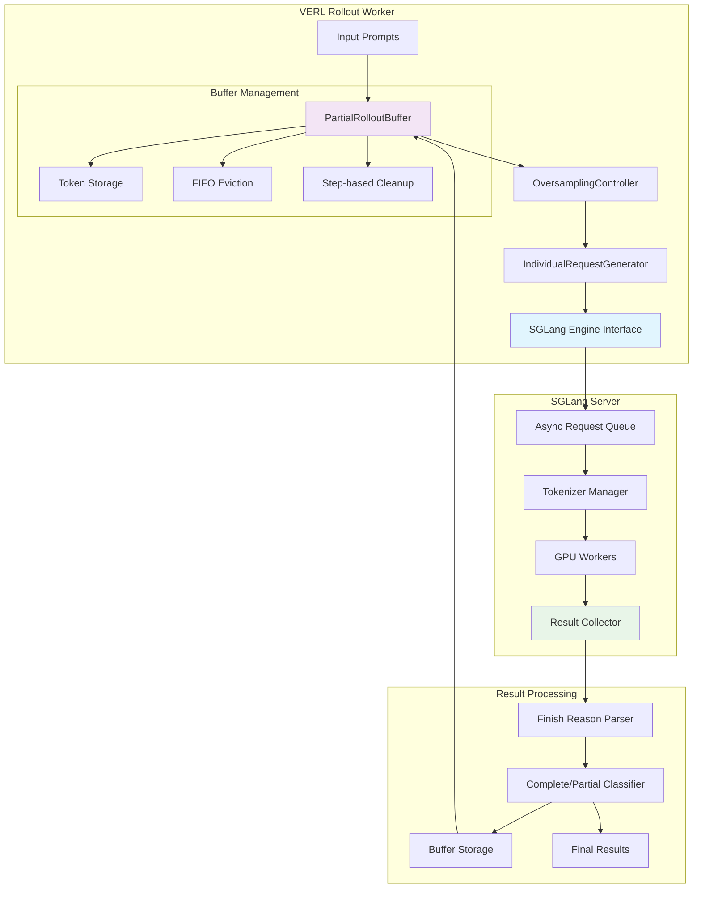

## 2. Request Lifecycle Flow Diagram

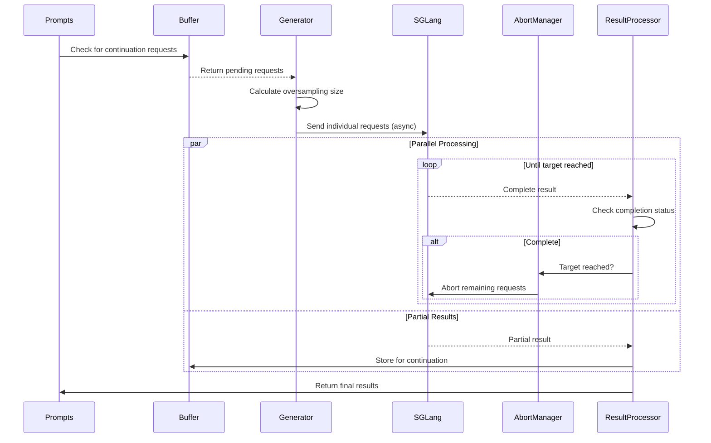

## 3. Buffer State Transition Diagram

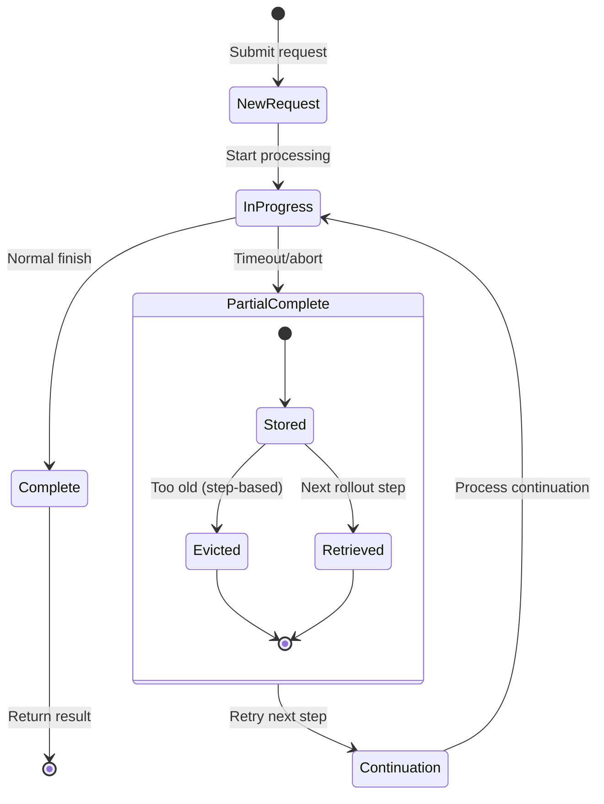

## 4. Performance Comparison Chart

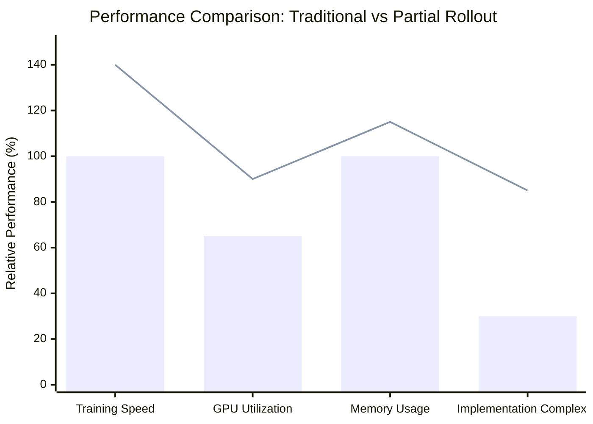

## 5. Oversampling Strategy Visualization

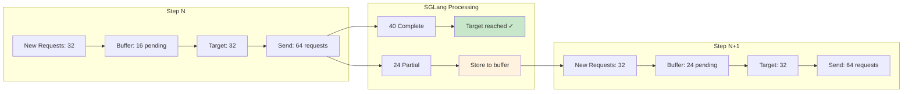

## 6. Token Management Flow Diagram

```mermaid
flowchart TD
    A[Original Input Tokens] --> B[Generate Response]
    B --> C{Complete?}
    C -->|Yes| D[Return Full Result]
    C -->|No| E[Store Partial Result]
    E --> F[Next Rollout Step]
    F --> G[Concatenate: Original + Partial]
    G --> H[Generate Continuation]
    H --> I{Complete?}
    I -->|Yes| D
    I -->|No| E

    subgraph "Token Operations"
        J[Token ID: [10,20,30]]
        K[Partial: [100,101]]
        L[Continued: [10,20,30,100,101]]
        M[Response: [200,201,202]]
    end

    style J fill:#e3f2fd
    style K fill:#fce4ec
    style L fill:#f3e5f5
    style M fill:#e8f5e8
```

## 7. Error Handling Flow Diagram

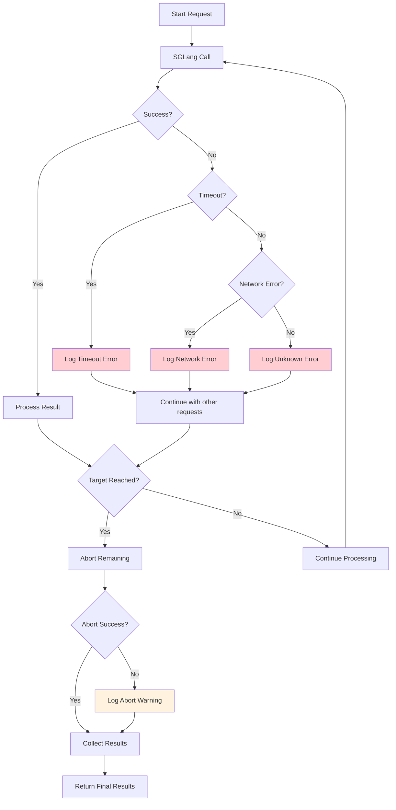

## 8. Memory Usage Timeline

```mermaid
gantt
    title Memory Usage Over Time
    dateFormat X
    axisFormat %s

    section Buffer Management
    Initial State :done, init, 0, 1s
    Store Partial Results :active, store, 1, 3s
    FIFO Eviction :evict, 2, 1s
    Step-based Cleanup :cleanup, 3, 1s

    section Request Processing
    Send Requests :send, 0, 1s
    Process Results :process, 1, 2s
    Collect Results :collect, 3, 1s

    section Memory Peaks
    Buffer Peak :milestone, peak1, 2s, 0s
    Processing Peak :milestone, peak2, 2s, 0s
```

## 9. Multi-Modal Data Flow

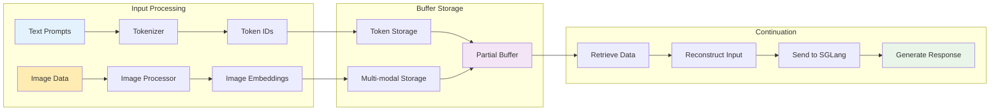

## 10. Configuration Impact Analysis

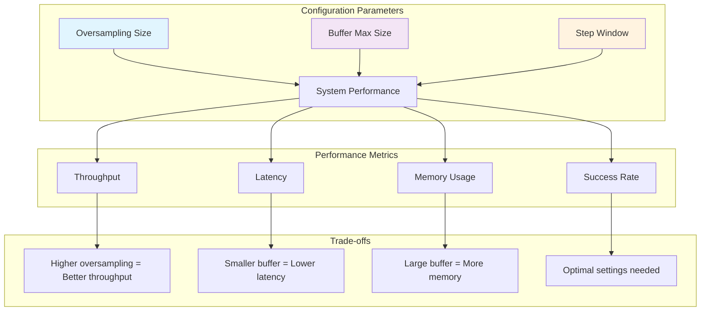

## 11. Real-world Scenario Example

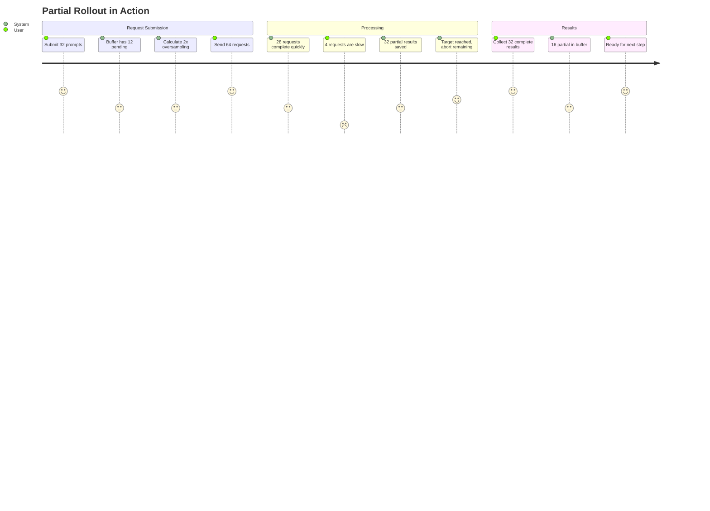

## 12. Code Structure Overview

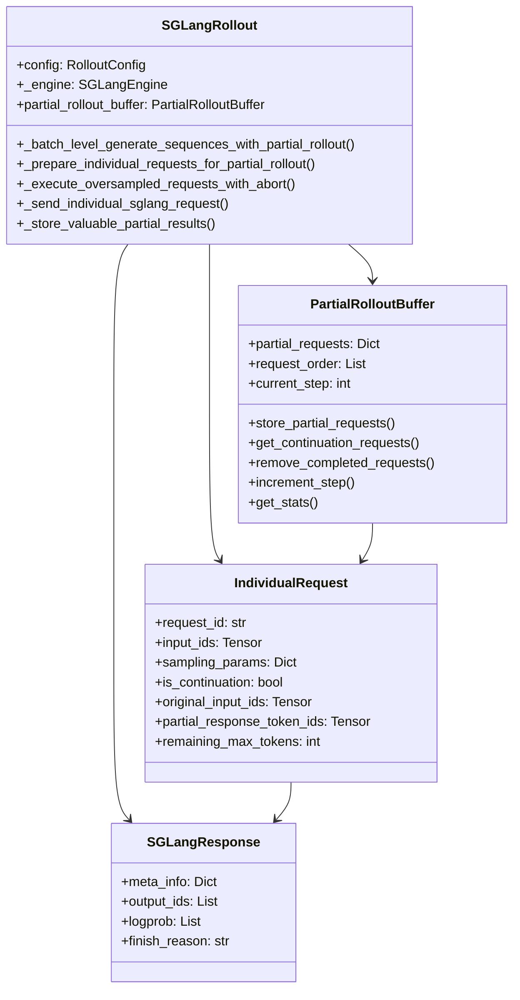

## 13. Debugging Flow Diagram

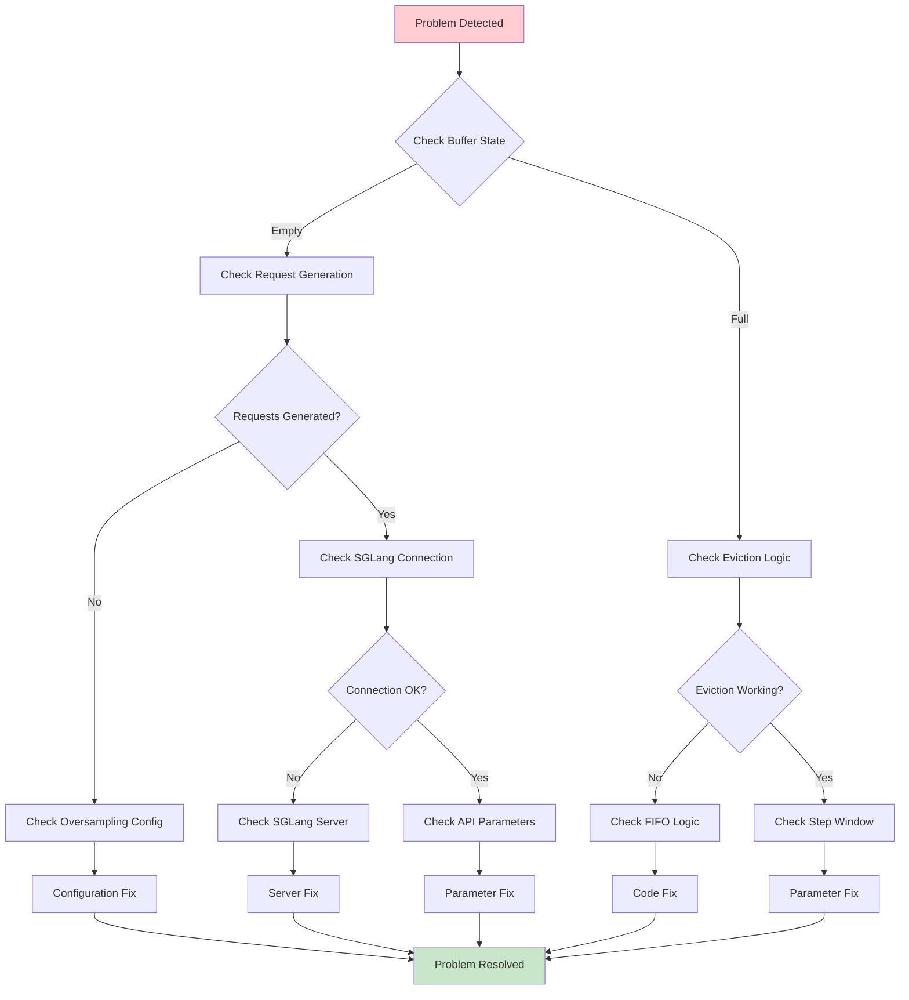

## 14. Usage Guidelines

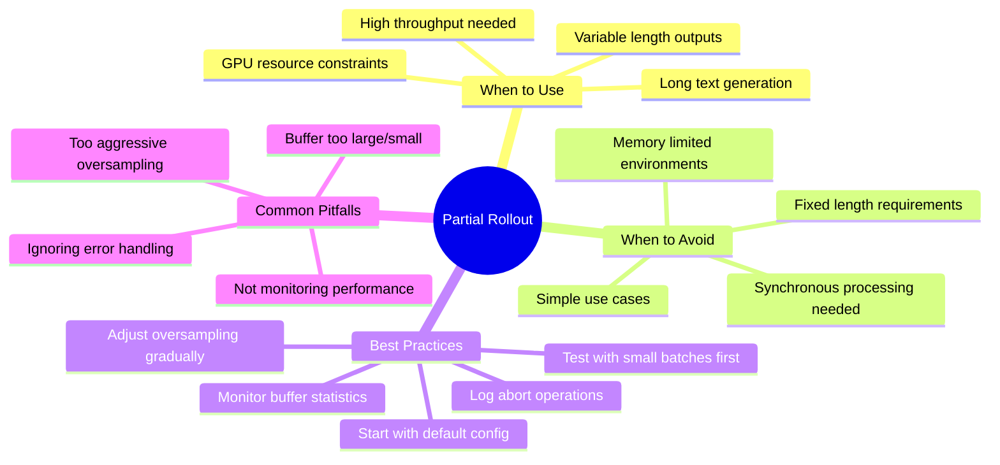
