# AReaL训练框架依赖分析报告

## 框架概述

AReaL (Ant Reasoning Reinforcement Learning) 是一个开源的**完全异步强化学习训练系统**，专门用于大规模推理模型的训练。该框架基于ReaLHF项目构建，提供了完整的训练细节、数据和基础设施，支持从单节点到1K GPU的大规模分布式训练。

**核心特点：**
- ⚡ **完全异步RL训练**：通过算法-系统协同设计，实现最快的训练速度
- 🚀 **高可扩展性**：支持从单节点到1K GPU的无缝扩展
- 🛠️ **开放可重现**：持续发布所有代码、数据集和训练配方
- 🔪 **前沿性能**：在数学和编程推理任务上达到前沿水平

## 核心训练模块分析

### 1. 训练引擎模块 (Training Engine)

#### 1.1 基础HuggingFace引擎 (BaseHFEngine)
- **功能**：提供基于HuggingFace Transformers的基础训练能力
- **核心依赖**：
  - `transformers`：模型加载、配置和tokenizer管理
  - `torch`：深度学习计算基础
  - `tensordict`：数据结构管理

#### 1.2 FSDP引擎 (FSDPEngine)
- **功能**：实现Fully Sharded Data Parallel训练
- **核心依赖**：
  - `torch.distributed`：分布式训练基础设施
  - `torch.distributed.checkpoint`：分布式检查点
  - `torch.distributed.device_mesh`：设备网格管理
  - `tensordict`：数据打包和传输

#### 1.3 Megatron引擎 (MegatronEngine)
- **功能**：基于Megatron-Core的高性能训练
- **核心依赖**：
  - `megatron-core`：NVIDIA的高性能训练框架
  - `mbridge`：模型桥接工具
  - `torch.distributed`：分布式通信

#### 1.4 DeepSpeed自动张量并行引擎 (DeepSpeedAutoTPEngine)
- **功能**：基于DeepSpeed的自动张量并行
- **核心依赖**：
  - `deepspeed`：微软的分布式训练框架
  - `torch.distributed`：分布式通信

#### 1.5 SGLang远程引擎 (RemoteSGLangEngine)
- **功能**：基于SGLang的远程推理服务
- **核心依赖**：
  - `sglang`：高性能推理框架
  - `aiohttp`：异步HTTP通信
  - `uvloop`：高性能事件循环

### 2. 数据加载模块 (Data Loading)

#### 2.1 数据集管理
- **功能**：支持多种推理数据集（GSM8K、Geometry3K、CLEVR等）
- **核心依赖**：
  - `datasets`：HuggingFace数据集库
  - `torchdata`：PyTorch数据加载工具
  - `tensordict`：数据打包和批处理

#### 2.2 数据预处理
- **功能**：序列打包、填充、注意力掩码生成
- **核心依赖**：
  - `einops`：张量重排操作
  - `torch.nn.functional`：神经网络函数
  - `tensordict`：数据结构管理

### 3. 强化学习模块 (Reinforcement Learning)

#### 3.1 PPO训练 (PPO Training)
- **功能**：Proximal Policy Optimization算法实现
- **核心依赖**：
  - `gymnasium`：强化学习环境
  - `tensordict`：经验回放缓冲区
  - `torch`：梯度计算和优化

#### 3.2 奖励计算 (Reward Computation)
- **功能**：数学推理、代码执行、视觉推理的奖励计算
- **核心依赖**：
  - `sympy`：符号数学计算
  - `ast`：Python代码解析
  - `torch`：张量计算

### 4. 分布式训练模块 (Distributed Training)

#### 4.1 启动器 (Launcher)
- **功能**：支持多种分布式训练启动方式
- **核心依赖**：
  - `ray`：分布式计算框架
  - `torchrun`：PyTorch分布式启动器
  - `slurm`：集群作业调度

#### 4.2 通信管理
- **功能**：进程间通信、梯度同步、权重更新
- **核心依赖**：
  - `torch.distributed`：分布式通信
  - `NCCL`：GPU间通信
  - `redis`：分布式缓存

### 5. 工作流模块 (Workflow)

#### 5.1 多轮对话 (Multi-turn)
- **功能**：支持多轮对话的强化学习训练
- **核心依赖**：
  - `tensordict`：对话历史管理
  - `torch`：序列处理

#### 5.2 视觉推理 (Vision RLVR)
- **功能**：视觉-语言推理的强化学习
- **核心依赖**：
  - `torchvision`：视觉模型
  - `transformers`：多模态模型

## 关键基础库依赖分析

### 1. 数据结构管理库

#### TensorDict
- **用途**：统一的数据结构管理，支持嵌套张量、批处理、设备管理
- **应用场景**：
  - 训练数据打包和传输
  - 经验回放缓冲区
  - 模型输入输出管理
  - 分布式数据同步
- **信源**：`requirements.txt:75`, `pyproject.toml:47`

#### PyTorch Data
- **用途**：高效的数据加载和预处理
- **应用场景**：
  - 流式数据加载
  - 数据预处理管道
  - 内存优化
- **信源**：`requirements.txt:74`, `pyproject.toml:46`

### 2. 分布式计算库

#### Ray
- **用途**：分布式计算框架，提供任务调度、资源管理、容错机制
- **应用场景**：
  - 分布式训练启动
  - 资源分配和调度
  - 故障恢复
  - 异步任务执行
- **信源**：`requirements.txt:35`, `pyproject.toml:67`

#### DeepSpeed
- **用途**：微软的分布式训练框架，提供ZeRO优化、混合精度训练
- **应用场景**：
  - 内存优化训练
  - 自动张量并行
  - 梯度累积
- **信源**：`requirements.txt:76`, `pyproject.toml:68`

#### Megatron-Core
- **用途**：NVIDIA的高性能训练框架，提供张量并行、流水线并行
- **应用场景**：
  - 大规模模型训练
  - 高效的并行策略
  - 内存优化
- **信源**：`requirements.txt:42`, `pyproject.toml:33`

### 3. 模型框架库

#### Transformers
- **用途**：HuggingFace的预训练模型库，提供模型加载、配置、tokenizer
- **应用场景**：
  - 预训练模型加载
  - Tokenizer管理
  - 模型配置
  - 推理和生成
- **信源**：`requirements.txt:77`, `pyproject.toml:34`

#### Accelerate
- **用途**：HuggingFace的分布式训练加速库
- **应用场景**：
  - 分布式训练简化
  - 混合精度训练
  - 设备管理
- **信源**：`requirements.txt:8`, `pyproject.toml:32`

### 4. 推理加速库

#### SGLang
- **用途**：高性能推理框架，支持流式生成、批处理优化
- **应用场景**：
  - 高效推理服务
  - 流式文本生成
  - 批处理优化
- **信源**：`Dockerfile:47-56`

#### Flash Attention
- **用途**：高效的注意力机制实现
- **应用场景**：
  - 长序列处理
  - 内存优化
  - 计算加速
- **信源**：`Dockerfile:38-42`

### 5. 强化学习库

#### Gymnasium
- **用途**：强化学习环境标准库
- **应用场景**：
  - RL环境定义
  - 动作空间管理
  - 奖励计算
- **信源**：`requirements.txt:65`, `pyproject.toml:45`

## 模块与基础库关联关系图

```mermaid
graph TB
    %% 基础库节点
    subgraph "基础库"
        TD[TensorDict]
        RAY[Ray]
        DS[DeepSpeed]
        MC[Megatron-Core]
        TF[Transformers]
        ACC[Accelerate]
        SGL[SGLang]
        FA[Flash Attention]
        GYM[Gymnasium]
        TORCH[PyTorch]
    end
    
    %% 训练引擎模块
    subgraph "训练引擎"
        BHE[BaseHFEngine]
        FSE[FSDPEngine]
        ME[MegatronEngine]
        DSE[DeepSpeedAutoTPEngine]
        SRE[RemoteSGLangEngine]
    end
    
    %% 数据模块
    subgraph "数据模块"
        DL[Data Loading]
        DP[Data Preprocessing]
        DSET[Dataset Management]
    end
    
    %% RL模块
    subgraph "强化学习"
        PPO[PPO Training]
        REW[Reward Computation]
        ENV[Environment]
    end
    
    %% 分布式模块
    subgraph "分布式训练"
        LAU[Launcher]
        COMM[Communication]
        SYNC[Synchronization]
    end
    
    %% 工作流模块
    subgraph "工作流"
        MT[Multi-turn]
        VR[Vision RLVR]
        WF[Workflow Executor]
    end
    
    %% 关联关系
    %% TensorDict关联
    TD --> BHE
    TD --> FSE
    TD --> ME
    TD --> DL
    TD --> DP
    TD --> PPO
    TD --> MT
    TD --> VR
    
    %% Ray关联
    RAY --> LAU
    RAY --> COMM
    RAY --> SYNC
    
    %% DeepSpeed关联
    DS --> DSE
    DS --> COMM
    DS --> SYNC
    
    %% Megatron-Core关联
    MC --> ME
    MC --> COMM
    MC --> SYNC
    
    %% Transformers关联
    TF --> BHE
    TF --> SRE
    TF --> DSET
    TF --> VR
    
    %% Accelerate关联
    ACC --> BHE
    ACC --> FSE
    
    %% SGLang关联
    SGL --> SRE
    SGL --> WF
    
    %% Flash Attention关联
    FA --> BHE
    FA --> FSE
    FA --> ME
    
    %% Gymnasium关联
    GYM --> PPO
    GYM --> ENV
    
    %% PyTorch关联
    TORCH --> BHE
    TORCH --> FSE
    TORCH --> ME
    TORCH --> DSE
    TORCH --> DL
    TORCH --> DP
    TORCH --> PPO
    TORCH --> COMM
    TORCH --> SYNC
    
    %% 模块间关联
    BHE --> PPO
    FSE --> PPO
    ME --> PPO
    DSE --> PPO
    SRE --> WF
    DL --> PPO
    DP --> PPO
    REW --> PPO
    ENV --> PPO
    LAU --> PPO
    COMM --> PPO
    SYNC --> PPO
    MT --> WF
    VR --> WF
```

## 关键依赖统计

### 核心基础库使用频率
1. **TensorDict**: 28个文件使用，主要用于数据结构管理
2. **Ray**: 12个文件使用，主要用于分布式计算
3. **Transformers**: 25个文件使用，主要用于模型管理
4. **Megatron-Core**: 8个文件使用，主要用于高性能训练
5. **DeepSpeed**: 3个文件使用，主要用于内存优化训练

### 模块复杂度分析
1. **训练引擎模块**: 最复杂，集成了多种训练后端
2. **数据模块**: 中等复杂度，专注于高效数据处理
3. **强化学习模块**: 中等复杂度，实现PPO等算法
4. **分布式模块**: 高复杂度，处理大规模分布式训练
5. **工作流模块**: 低复杂度，主要协调各模块

## 总结

AReaL框架通过精心设计的模块化架构，充分利用了业界领先的基础库能力：

1. **TensorDict**作为统一的数据结构管理工具，贯穿整个训练流程
2. **Ray**提供强大的分布式计算能力，支持大规模训练
3. **Megatron-Core**和**DeepSpeed**提供高性能的训练后端
4. **Transformers**和**SGLang**提供模型管理和推理能力
5. **Gymnasium**提供标准化的强化学习环境

这种设计使得AReaL能够实现完全异步的强化学习训练，在保持高性能的同时提供良好的可扩展性和易用性。

## 信源

- AReaL项目代码库: `/Users/huangyuxiao/projects/AReaL/`
- 依赖配置文件: `requirements.txt`, `pyproject.toml`
- Docker配置: `Dockerfile`
- 官方文档: `README.md`, `docs/`
- 论文: https://arxiv.org/pdf/2505.24298
