# LLaMA-Factory 训练框架依赖分析报告

## 概述

LLaMA-Factory 是一个基于 HuggingFace Transformers 的大语言模型训练框架，提供了完整的 SFT、DPO、PPO、KTO 等训练方法。本文档分析了该框架的核心训练模块及其依赖的关键三方库。

## 框架核心模块分析

### 1. 训练模块 (Training Modules)
- **SFT Trainer**: 监督微调训练器
- **DPO Trainer**: 直接偏好优化训练器  
- **PPO Trainer**: 近端策略优化训练器
- **KTO Trainer**: Kullback-Leibler 散度优化训练器
- **RM Trainer**: 奖励模型训练器

### 2. 模型模块 (Model Modules)
- **Model Loader**: 模型加载器
- **Adapter**: 适配器管理 (LoRA, QLoRA, OFT等)
- **Patcher**: 模型补丁器
- **Attention**: 注意力机制优化
- **Quantization**: 量化支持 (GPTQ, AWQ, AQLM等)

### 3. 数据处理模块 (Data Processing Modules)
- **Data Loader**: 数据加载器
- **Collator**: 数据整理器
- **Processor**: 数据处理器
- **Template**: 模板处理器
- **MM Plugin**: 多模态插件

### 4. 评估模块 (Evaluation Modules)
- **Evaluator**: 模型评估器
- **Metrics**: 评估指标

## 关键三方库依赖分析

### 1. 核心训练库

#### Transformers (HuggingFace)
- **功能**: 提供预训练模型、分词器、训练器基础架构
- **版本要求**: >=4.49.0,<=4.55.0,!=4.52.0
- **关联模块**: 
  - 所有训练模块 (SFT, DPO, PPO, KTO, RM)
  - 模型加载和适配器模块
  - 数据处理模块

#### Accelerate (HuggingFace)
- **功能**: 分布式训练加速和混合精度训练
- **版本要求**: >=1.3.0,<=1.7.0
- **关联模块**:
  - 所有训练模块
  - 分布式训练支持

#### TRL (HuggingFace)
- **功能**: Transformer Reinforcement Learning 库
- **版本要求**: >=0.8.6,<=0.9.6
- **关联模块**:
  - DPO Trainer
  - PPO Trainer
  - RM Trainer

#### PEFT (HuggingFace)
- **功能**: Parameter-Efficient Fine-Tuning 库
- **版本要求**: >=0.14.0,<=0.15.2
- **关联模块**:
  - Adapter 模块 (LoRA, QLoRA, OFT)
  - 模型适配器管理

### 2. 数据处理库

#### Datasets (HuggingFace)
- **功能**: 数据集加载和处理
- **版本要求**: >=2.16.0,<=3.6.0
- **关联模块**:
  - Data Loader
  - Data Processor
  - 评估模块

#### Tokenizers (HuggingFace)
- **功能**: 分词器
- **版本要求**: >=0.19.0,<=0.21.1
- **关联模块**:
  - 所有数据处理模块
  - 模型加载模块

### 3. 分布式训练库

#### DeepSpeed (Microsoft)
- **功能**: 分布式训练优化
- **版本要求**: >=0.10.0,<=0.16.9
- **关联模块**:
  - 所有训练模块
  - 模型分片和优化

#### Ray
- **功能**: 分布式计算框架
- **关联模块**:
  - 分布式训练支持
  - 超参数调优

### 4. 注意力优化库

#### FlashAttention-2
- **功能**: 高效注意力计算
- **关联模块**:
  - Attention 模块
  - 所有训练模块

#### PyTorch SDPA
- **功能**: PyTorch 原生注意力优化
- **关联模块**:
  - Attention 模块

### 5. 量化库

#### AutoGPTQ
- **功能**: GPTQ 量化
- **关联模块**:
  - Quantization 模块

#### AutoAWQ
- **功能**: AWQ 量化
- **关联模块**:
  - Quantization 模块

#### AQLM
- **功能**: AQLM 量化
- **关联模块**:
  - Quantization 模块

### 6. 优化器库

#### GaLore
- **功能**: 低秩梯度优化
- **关联模块**:
  - 训练优化器

#### APOLLO
- **功能**: 自适应优化器
- **关联模块**:
  - 训练优化器

#### BAdam
- **功能**: 分层优化器
- **关联模块**:
  - 训练优化器

## 模块与库的关联关系图

```mermaid
graph TB
    %% 核心训练库
    Transformers[Transformers] --> SFT[SFT Trainer]
    Transformers --> DPO[DPO Trainer]
    Transformers --> PPO[PPO Trainer]
    Transformers --> KTO[KTO Trainer]
    Transformers --> RM[RM Trainer]
    Transformers --> ModelLoader[Model Loader]
    Transformers --> Adapter[Adapter]
    
    Accelerate[Accelerate] --> SFT
    Accelerate --> DPO
    Accelerate --> PPO
    Accelerate --> KTO
    Accelerate --> RM
    
    TRL[TRL] --> DPO
    TRL --> PPO
    TRL --> RM
    
    PEFT[PEFT] --> Adapter
    PEFT --> ModelLoader
    
    %% 数据处理库
    Datasets[Datasets] --> DataLoader[Data Loader]
    Datasets --> DataProcessor[Data Processor]
    Datasets --> Evaluator[Evaluator]
    
    Tokenizers[Tokenizers] --> DataLoader
    Tokenizers --> DataProcessor
    Tokenizers --> ModelLoader
    
    %% 分布式训练库
    DeepSpeed[DeepSpeed] --> SFT
    DeepSpeed --> DPO
    DeepSpeed --> PPO
    DeepSpeed --> KTO
    DeepSpeed --> RM
    
    Ray[Ray] --> SFT
    Ray --> DPO
    Ray --> PPO
    Ray --> KTO
    Ray --> RM
    
    %% 注意力优化库
    FlashAttn[FlashAttention-2] --> Attention[Attention Module]
    FlashAttn --> SFT
    FlashAttn --> DPO
    FlashAttn --> PPO
    FlashAttn --> KTO
    FlashAttn --> RM
    
    SDPA[PyTorch SDPA] --> Attention
    SDPA --> SFT
    SDPA --> DPO
    SDPA --> PPO
    SDPA --> KTO
    SDPA --> RM
    
    %% 量化库
    AutoGPTQ[AutoGPTQ] --> Quantization[Quantization Module]
    AutoAWQ[AutoAWQ] --> Quantization
    AQLM[AQLM] --> Quantization
    
    Quantization --> ModelLoader
    Quantization --> SFT
    Quantization --> DPO
    Quantization --> PPO
    Quantization --> KTO
    Quantization --> RM
    
    %% 优化器库
    GaLore[GaLore] --> Optimizer[Optimizer]
    APOLLO[APOLLO] --> Optimizer
    BAdam[BAdam] --> Optimizer
    
    Optimizer --> SFT
    Optimizer --> DPO
    Optimizer --> PPO
    Optimizer --> KTO
    Optimizer --> RM
    
    %% 数据处理模块
    DataLoader --> SFT
    DataLoader --> DPO
    DataLoader --> PPO
    DataLoader --> KTO
    DataLoader --> RM
    
    DataProcessor --> DataLoader
    Collator[Collator] --> DataLoader
    Template[Template] --> DataProcessor
    MMPlugin[MM Plugin] --> DataProcessor
    
    %% 模型模块
    ModelLoader --> SFT
    ModelLoader --> DPO
    ModelLoader --> PPO
    ModelLoader --> KTO
    ModelLoader --> RM
    
    Adapter --> ModelLoader
    Patcher[Patcher] --> ModelLoader
    Attention --> ModelLoader
    
    %% 评估模块
    Evaluator --> SFT
    Evaluator --> DPO
    Evaluator --> PPO
    Evaluator --> KTO
    Evaluator --> RM
    
    %% 样式
    classDef coreLib fill:#e1f5fe
    classDef dataLib fill:#f3e5f5
    classDef distLib fill:#fff3e0
    classDef attnLib fill:#e8f5e8
    classDef quantLib fill:#fff8e1
    classDef optLib fill:#fce4ec
    classDef module fill:#f1f8e9
    
    class Transformers,Accelerate,TRL,PEFT coreLib
    class Datasets,Tokenizers dataLib
    class DeepSpeed,Ray distLib
    class FlashAttn,SDPA attnLib
    class AutoGPTQ,AutoAWQ,AQLM quantLib
    class GaLore,APOLLO,BAdam optLib
    class SFT,DPO,PPO,KTO,RM,ModelLoader,Adapter,DataLoader,DataProcessor,Evaluator,Attention,Quantization,Optimizer,Collator,Template,MMPlugin,Patcher module
```

## 关键特性分析

### 1. 训练方法完备性
- 支持 SFT、DPO、PPO、KTO、RM 等多种训练方法
- 基于 HuggingFace Transformers 生态，兼容性好
- 支持多种优化器和训练策略

### 2. 模型适配能力
- 支持 LoRA、QLoRA、OFT 等多种参数高效微调方法
- 支持 GPTQ、AWQ、AQLM 等多种量化方法
- 支持 FlashAttention-2 和 PyTorch SDPA 注意力优化

### 3. 分布式训练支持
- 集成 DeepSpeed 和 FSDP 分布式训练
- 支持 Ray 分布式计算框架
- 支持多 GPU 和多节点训练

### 4. 数据处理能力
- 支持多种数据格式和来源
- 支持多模态数据处理
- 提供灵活的数据处理管道

## 信源

1. **requirements.txt**: 项目依赖文件
2. **pyproject.toml**: 项目配置文件
3. **src/llamafactory/train/**: 训练模块源码
4. **src/llamafactory/model/**: 模型模块源码
5. **src/llamafactory/data/**: 数据处理模块源码
6. **src/llamafactory/extras/packages.py**: 包依赖检查
7. **examples/**: 配置示例文件

## 总结

LLaMA-Factory 是一个功能完备的大语言模型训练框架，其核心优势在于：

1. **生态集成度高**: 深度集成 HuggingFace 生态，兼容性好
2. **训练方法丰富**: 支持当前主流的训练方法
3. **优化手段多样**: 支持多种注意力优化、量化和分布式训练方案
4. **扩展性强**: 模块化设计，易于扩展新的训练方法和优化策略

该框架主要依赖 HuggingFace 的 Transformers、Accelerate、TRL、PEFT 等核心库，同时集成了 DeepSpeed、FlashAttention-2 等高性能训练库，为大规模语言模型训练提供了完整的解决方案。
