# MindSpeed-RL 训练框架依赖分析报告

## 概述

MindSpeed-RL是基于昇腾生态的强化学习加速框架，旨在为华为昇腾芯片生态合作伙伴提供端到端的RL训推解决方案。本报告分析了该框架的核心模块和关键第三方库依赖关系。

## 核心模块分析

基于代码结构分析，MindSpeed-RL训练框架可分为以下核心模块：

### 1. 训练算法模块 (Training Algorithms)
- **GRPO Trainer**: 基于Ray的GRPO训练器
- **DPO Trainer**: 基于Ray的DPO训练器  
- **PPO Trainer**: 基于Ray的PPO训练器
- **DAPO Trainer**: 基于Ray的DAPO训练器

### 2. 推理引擎模块 (Inference Engine)
- **VLLM Engine**: 基于vLLM的高性能推理引擎
- **Rollout Engine**: 支持推理和训练混合的rollout引擎
- **Weight Management**: Megatron权重管理和分片

### 3. 数据处理模块 (Data Processing)
- **Prompt Dataset**: 提示数据集处理
- **Data Loader**: 数据加载器
- **Data Handler**: 多模态数据处理
- **Indexed Dataset**: 索引数据集

### 4. 模型管理模块 (Model Management)
- **Actor Model**: 演员模型
- **Reference Model**: 参考模型
- **Reward Model**: 奖励模型
- **Critic Model**: 评论家模型

### 5. 分布式调度模块 (Distributed Scheduling)
- **Ray Actor Group**: Ray分布式Actor管理
- **Worker Management**: 工作节点管理
- **Parallel State**: 并行状态管理

### 6. 监控日志模块 (Monitoring & Logging)
- **WandB Logger**: Weights & Biases日志
- **TensorBoard**: TensorBoard可视化
- **Metrics**: 训练指标计算

## 关键第三方库依赖分析

### 1. 分布式计算框架
- **Ray (2.42.1)**: 核心分布式计算框架
  - 用于分布式训练调度
  - Actor模式管理
  - 资源分配和任务调度
  - 信源: [Ray官方文档](https://docs.ray.io/)

### 2. 数据结构管理
- **TensorDict (0.1.2)**: 张量字典数据结构
  - 用于训练数据的结构化存储
  - 支持批处理和并行处理
  - 信源: [TensorDict官方文档](https://pytorch.org/tensordict/)

### 3. 深度学习框架
- **PyTorch (2.5.1)**: 核心深度学习框架
- **torch_npu**: 昇腾NPU适配
- **transformers (4.52.1)**: Hugging Face模型库
  - 用于模型加载和tokenizer处理
  - 信源: [Transformers官方文档](https://huggingface.co/docs/transformers/)

### 4. 推理加速库
- **vLLM**: 高性能推理引擎
  - 用于模型推理和rollout
  - 支持多种并行策略
  - 信源: [vLLM官方文档](https://docs.vllm.ai/)
- **vLLM-ascend**: 昇腾适配版本

### 5. 模型并行框架
- **Megatron-LM**: NVIDIA大规模模型并行框架
  - 用于模型分片和并行训练
  - 支持tensor/pipeline/expert并行
  - 信源: [Megatron-LM官方文档](https://github.com/NVIDIA/Megatron-LM)

### 6. 配置管理
- **Hydra (1.3.2)**: 配置管理框架
  - 用于训练配置管理
  - 支持配置组合和覆盖
  - 信源: [Hydra官方文档](https://hydra.cc/)

### 7. 数据处理
- **datasets**: Hugging Face数据集库
  - 用于数据集加载和处理
  - 支持多模态数据
  - 信源: [Datasets官方文档](https://huggingface.co/docs/datasets/)

### 8. 实验跟踪
- **wandb**: Weights & Biases实验跟踪
  - 用于训练过程可视化
  - 支持丰富的指标展示
  - 信源: [WandB官方文档](https://wandb.ai/)
- **tensorboard**: TensorBoard可视化
  - 用于离线训练监控
  - 信源: [TensorBoard官方文档](https://www.tensorflow.org/tensorboard)

## 依赖关系关联图

```mermaid
graph TB
    %% 核心框架
    MSRL[MindSpeed-RL] --> Ray[Ray分布式框架]
    MSRL --> TensorDict[TensorDict数据结构]
    MSRL --> PyTorch[PyTorch深度学习框架]
    MSRL --> vLLM[vLLM推理引擎]
    MSRL --> Megatron[Megatron-LM并行框架]
    
    %% 训练算法模块
    Ray --> GRPO[GRPO Trainer]
    Ray --> DPO[DPO Trainer]
    Ray --> PPO[PPO Trainer]
    Ray --> DAPO[DAPO Trainer]
    
    %% 推理引擎模块
    vLLM --> VLLMEngine[VLLM Engine]
    vLLM --> RolloutEngine[Rollout Engine]
    Megatron --> WeightMgmt[Weight Management]
    
    %% 数据处理模块
    TensorDict --> PromptDS[Prompt Dataset]
    TensorDict --> DataLoader[Data Loader]
    datasets --> DataHandler[Data Handler]
    datasets --> IndexedDS[Indexed Dataset]
    
    %% 模型管理模块
    PyTorch --> ActorModel[Actor Model]
    PyTorch --> RefModel[Reference Model]
    PyTorch --> RewardModel[Reward Model]
    PyTorch --> CriticModel[Critic Model]
    
    %% 分布式调度模块
    Ray --> ActorGroup[Ray Actor Group]
    Ray --> WorkerMgmt[Worker Management]
    Ray --> ParallelState[Parallel State]
    
    %% 监控日志模块
    wandb --> WandBLogger[WandB Logger]
    tensorboard --> TensorBoardLogger[TensorBoard Logger]
    
    %% 配置管理
    Hydra --> ConfigMgmt[Configuration Management]
    
    %% 样式定义
    classDef framework fill:#e1f5fe
    classDef training fill:#f3e5f5
    classDef inference fill:#e8f5e8
    classDef data fill:#fff3e0
    classDef model fill:#fce4ec
    classDef distributed fill:#f1f8e9
    classDef monitoring fill:#fafafa
    
    class MSRL,Ray,TensorDict,PyTorch,vLLM,Megatron framework
    class GRPO,DPO,PPO,DAPO training
    class VLLMEngine,RolloutEngine,WeightMgmt inference
    class PromptDS,DataLoader,DataHandler,IndexedDS data
    class ActorModel,RefModel,RewardModel,CriticModel model
    class ActorGroup,WorkerMgmt,ParallelState distributed
    class WandBLogger,TensorBoardLogger,ConfigMgmt monitoring
```

## 模块与依赖库的详细关联

### 训练算法模块 ↔ Ray
- **关联强度**: 强依赖
- **用途**: 所有训练器都基于Ray实现分布式训练
- **具体应用**: Actor模式、任务调度、资源管理

### 推理引擎模块 ↔ vLLM + Megatron
- **关联强度**: 强依赖
- **用途**: 高性能推理和模型并行
- **具体应用**: 模型推理、权重分片、并行策略

### 数据处理模块 ↔ TensorDict + datasets
- **关联强度**: 中等依赖
- **用途**: 数据结构和加载
- **具体应用**: 批处理、多模态数据、索引管理

### 模型管理模块 ↔ PyTorch + transformers
- **关联强度**: 强依赖
- **用途**: 模型定义和加载
- **具体应用**: 神经网络层、tokenizer、模型权重

### 分布式调度模块 ↔ Ray
- **关联强度**: 强依赖
- **用途**: 分布式计算和调度
- **具体应用**: Actor管理、资源分配、通信

### 监控日志模块 ↔ wandb + tensorboard
- **关联强度**: 弱依赖
- **用途**: 实验跟踪和可视化
- **具体应用**: 训练曲线、指标记录、结果展示

## 总结

MindSpeed-RL训练框架的核心依赖关系可以概括为：

1. **Ray作为分布式计算骨干**: 支撑整个框架的分布式训练能力
2. **vLLM + Megatron提供推理和并行能力**: 实现高性能推理和模型并行
3. **PyTorch + TensorDict提供基础计算能力**: 支撑模型定义和数据处理
4. **Hydra提供配置管理**: 简化训练配置的复杂性
5. **wandb/tensorboard提供监控能力**: 支持训练过程的可视化

这种依赖架构使得MindSpeed-RL能够在昇腾生态上实现高效的强化学习训练，同时保持了良好的模块化和可扩展性。

## 信源列表

1. Ray官方文档: https://docs.ray.io/
2. TensorDict官方文档: https://pytorch.org/tensordict/
3. Transformers官方文档: https://huggingface.co/docs/transformers/
4. vLLM官方文档: https://docs.vllm.ai/
5. Megatron-LM官方文档: https://github.com/NVIDIA/Megatron-LM
6. Hydra官方文档: https://hydra.cc/
7. Datasets官方文档: https://huggingface.co/docs/datasets/
8. WandB官方文档: https://wandb.ai/
9. TensorBoard官方文档: https://www.tensorflow.org/tensorboard
