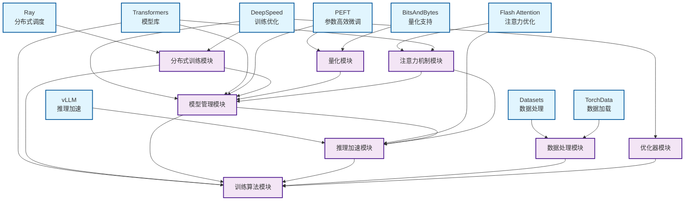

# OpenRLHF 框架依赖关系分析

## 框架概述

OpenRLHF 是一个基于 Ray、vLLM、ZeRO-3 和 HuggingFace Transformers 构建的高性能开源 RLHF 框架。该框架旨在使 RLHF 训练变得简单易用，支持分布式训练、推理加速和内存优化。

**信源**: [OpenRLHF GitHub Repository](https://github.com/OpenRLHF/OpenRLHF)

## 关键基础库分析

### 1. 分布式计算基础库

#### Ray (ray[default]==2.48.0)
- **功能**: 分布式任务调度和资源管理
- **在框架中的作用**: 
  - 实现 Actor、Reward、Reference、Critic 模型在不同 GPU 上的分布式调度
  - 支持 Hybrid Engine 调度，允许所有模型和 vLLM 引擎共享 GPU 资源
  - 提供分布式训练的基础设施
- **信源**: [Ray 官方文档](https://docs.ray.io/)

#### DeepSpeed (deepspeed==0.17.5)
- **功能**: 大规模模型训练优化
- **在框架中的作用**:
  - 实现 ZeRO-3 内存优化训练
  - 支持 AutoTP (Auto Tensor Parallelism)
  - 提供 FusedAdam 优化器
  - 支持 MoE (Mixture of Experts) 模型训练
- **信源**: [DeepSpeed GitHub](https://github.com/microsoft/DeepSpeed)

### 2. 推理加速基础库

#### vLLM (vllm==0.10.1.1)
- **功能**: 高性能大语言模型推理引擎
- **在框架中的作用**:
  - 加速 RLHF 训练中的样本生成阶段（占总时间的80%）
  - 提供 AutoTP 支持
  - 实现高吞吐量、内存高效的样本生成
- **信源**: [vLLM GitHub](https://github.com/vllm-project/vllm)

#### Flash Attention (flash-attn==2.8.3)
- **功能**: 高效的注意力机制实现
- **在框架中的作用**:
  - 加速注意力计算
  - 支持样本打包 (packing_samples)
  - 提供多种注意力实现选项 (flash_attention_2, flash_attention_3)
- **信源**: [Flash Attention GitHub](https://github.com/Dao-AILab/flash-attention)

### 3. 模型和训练基础库

#### Transformers (transformers==4.55.2)
- **功能**: HuggingFace 的预训练模型库
- **在框架中的作用**:
  - 提供预训练模型的加载和微调
  - 支持多种模型架构 (AutoModelForCausalLM, AutoModel)
  - 集成 Flash Attention 实现
  - 支持聊天模板 (chat_template)
- **信源**: [Transformers 官方文档](https://huggingface.co/docs/transformers)

#### PEFT (peft)
- **功能**: 参数高效微调
- **在框架中的作用**:
  - 实现 LoRA (Low-Rank Adaptation)
  - 支持 QLoRA (4-bit 量化)
  - 提供参数高效微调方法
- **信源**: [PEFT GitHub](https://github.com/huggingface/peft)

#### BitsAndBytes (bitsandbytes)
- **功能**: 量化训练支持
- **在框架中的作用**:
  - 支持 4-bit 量化训练
  - 实现 QLoRA 训练
  - 提供内存优化的量化方法
- **信源**: [BitsAndBytes GitHub](https://github.com/TimDettmers/bitsandbytes)

### 4. 数据处理基础库

#### Datasets (datasets)
- **功能**: HuggingFace 数据集处理库
- **在框架中的作用**:
  - 提供数据集加载和预处理
  - 支持多种数据格式
  - 实现数据集的混合和打包
- **信源**: [Datasets 官方文档](https://huggingface.co/docs/datasets)

#### TorchData (torchdata)
- **功能**: PyTorch 数据加载优化
- **在框架中的作用**:
  - 提供 StatefulDataLoader
  - 优化数据加载性能
  - 支持分布式数据采样
- **信源**: [TorchData 官方文档](https://pytorch.org/data/)

## 框架功能模块分析

### 1. 分布式训练模块 (Distributed Training)
- **核心组件**: Ray Actor Group, DeepSpeed Strategy
- **功能**: 实现多 GPU、多节点分布式训练
- **依赖库**: Ray, DeepSpeed, PyTorch Distributed

### 2. 模型管理模块 (Model Management)
- **核心组件**: Actor, Critic, Reward Model, Reference Model
- **功能**: 管理不同类型的模型（Actor、Critic、Reward、Reference）
- **依赖库**: Transformers, PEFT, DeepSpeed

### 3. 推理加速模块 (Inference Acceleration)
- **核心组件**: vLLM Engine, Flash Attention
- **功能**: 加速模型推理和样本生成
- **依赖库**: vLLM, Flash Attention, Transformers

### 4. 训练算法模块 (Training Algorithms)
- **核心组件**: PPO Trainer, DPO Trainer, REINFORCE++ Trainer
- **功能**: 实现各种 RLHF 训练算法
- **依赖库**: PyTorch, Transformers, DeepSpeed

### 5. 数据处理模块 (Data Processing)
- **核心组件**: Prompt Dataset, Reward Dataset, SFT Dataset
- **功能**: 处理不同类型的训练数据
- **依赖库**: Datasets, TorchData, Transformers

### 6. 优化器模块 (Optimization)
- **核心组件**: FusedAdam, DeepSpeedCPUAdam
- **功能**: 提供高效的优化器实现
- **依赖库**: DeepSpeed, PyTorch

### 7. 量化模块 (Quantization)
- **核心组件**: 4-bit Quantization, LoRA
- **功能**: 实现模型量化和参数高效微调
- **依赖库**: BitsAndBytes, PEFT

### 8. 注意力机制模块 (Attention Mechanisms)
- **核心组件**: Flash Attention, Ring Attention
- **功能**: 提供高效的注意力计算实现
- **依赖库**: Flash Attention, Transformers

## 依赖关系图

## 详细依赖关系表

| 基础库 | 功能模块 | 依赖关系描述 | 使用场景 |
|--------|----------|--------------|----------|
| **Ray** | 分布式训练模块 | 提供分布式任务调度和资源管理 | 多GPU、多节点训练调度 |
| **DeepSpeed** | 分布式训练模块 模型管理模块 优化器模块 | 实现ZeRO-3内存优化和AutoTP | 大规模模型训练优化 |
| **vLLM** | 推理加速模块 | 加速样本生成阶段 | RLHF训练中的推理加速 |
| **Flash Attention** | 推理加速模块 注意力机制模块 | 提供高效注意力计算 | 注意力计算优化 |
| **Transformers** | 模型管理模块 训练算法模块 注意力机制模块 | 提供预训练模型和训练工具 | 模型加载和训练 |
| **PEFT** | 模型管理模块 量化模块 | 实现LoRA和参数高效微调 | 模型微调优化 |
| **BitsAndBytes** | 量化模块 | 支持4-bit量化训练 | 内存优化训练 |
| **Datasets** | 数据处理模块 | 提供数据集处理功能 | 训练数据管理 |
| **TorchData** | 数据处理模块 | 优化数据加载性能 | 分布式数据采样 |

## 总结

OpenRLHF 框架通过整合多个业界领先的基础库，构建了一个完整的 RLHF 训练生态系统：

1. **分布式计算**: 基于 Ray 和 DeepSpeed 实现高效的分布式训练
2. **推理加速**: 通过 vLLM 和 Flash Attention 实现高性能推理
3. **模型优化**: 利用 PEFT 和 BitsAndBytes 实现参数高效微调和量化
4. **数据处理**: 基于 Transformers 和 Datasets 提供完整的数据处理流程

这种架构设计使得 OpenRLHF 能够支持大规模模型的 RLHF 训练，同时保持高性能和易用性。
