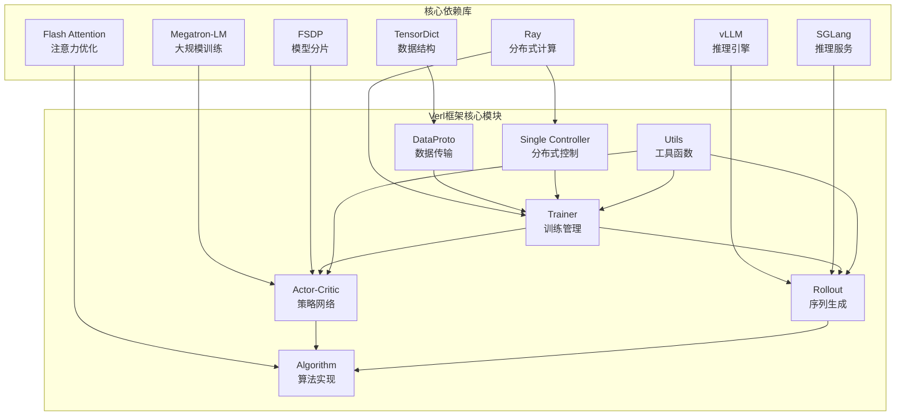

# Verl 训练框架依赖分析报告

## 1. 框架概述

Verl (Volcano Engine Reinforcement Learning) 是一个开源的、灵活的、高效的强化学习训练框架，专为大语言模型(LLM)的后训练设计，实现了HybridFlow论文。该框架支持多种RL算法扩展，与现有LLM基础设施无缝集成，提供灵活的设备映射和高吞吐量。

## 2. 核心依赖库分析

### 2.1 数据结构构建相关

#### TensorDict
- **作用**: 提供PyTorch生态系统中张量的类字典容器，用于数据交换和批处理
- **版本要求**: `tensordict>=0.8.0,<=0.9.1,!=0.9.0`
- **使用场景**: 
  - 数据协议(DataProto)的核心数据结构
  - 批处理数据的存储和传输
  - 分布式训练中的数据交换
- **信源**: `verl/protocol.py`, `verl/trainer/fsdp_sft_trainer.py`

#### PyArrow
- **作用**: 高性能的数据序列化和存储
- **版本要求**: `pyarrow>=19.0.0`
- **使用场景**: 数据集存储和加载，支持parquet格式

### 2.2 分布式计算相关

#### Ray
- **作用**: 分布式计算框架，提供任务调度、资源管理和分布式执行
- **版本要求**: `ray[default]>=2.41.0`
- **使用场景**:
  - 分布式worker管理
  - 资源池管理
  - 任务调度和负载均衡
  - 多节点训练协调
- **信源**: `verl/single_controller/ray/base.py`, `verl/trainer/ppo/ray_trainer.py`

#### PyTorch Distributed
- **作用**: PyTorch原生分布式训练支持
- **使用场景**: 
  - FSDP (Fully Sharded Data Parallel)
  - 模型并行和数据并行
  - 分布式通信

### 2.3 模型训练相关

#### Transformers
- **作用**: Hugging Face的预训练模型库
- **使用场景**: 
  - 模型加载和初始化
  - Tokenizer处理
  - 模型架构支持

#### Accelerate
- **作用**: Hugging Face的分布式训练加速库
- **使用场景**: 简化分布式训练配置

#### PEFT (Parameter-Efficient Fine-Tuning)
- **作用**: 参数高效微调库
- **使用场景**: LoRA等参数高效微调方法

### 2.4 性能优化相关

#### Flash Attention
- **作用**: 高效的注意力机制实现
- **使用场景**: 
  - 注意力计算优化
  - 内存使用优化
- **信源**: `verl/utils/torch_functional.py`, `verl/models/transformers/`

#### Liger Kernel
- **作用**: 高性能内核库
- **使用场景**: 计算优化

### 2.5 推理引擎相关

#### vLLM
- **作用**: 高性能LLM推理引擎
- **版本要求**: `vllm>=0.7.3,<=0.9.1`
- **使用场景**: 
  - 模型推理服务
  - 序列生成
  - 推理优化
- **信源**: `verl/workers/rollout/vllm_rollout/`

#### SGLang
- **作用**: 状态最先进的推理服务引擎
- **版本要求**: `sglang[srt,openai]==0.4.10.post2`
- **使用场景**: 
  - 多轮对话推理
  - 工具调用
  - 推理服务
- **信源**: `verl/workers/rollout/sglang_rollout/`

#### Megatron-LM
- **作用**: NVIDIA的大规模模型训练框架
- **使用场景**: 
  - 大规模模型训练
  - 模型并行
  - 5D并行策略
- **信源**: `verl/workers/megatron_workers.py`

### 2.6 监控和日志相关

#### WandB
- **作用**: 实验跟踪和可视化
- **使用场景**: 训练过程监控、指标记录

#### TensorBoard
- **作用**: 训练可视化工具
- **使用场景**: 训练曲线、模型分析

## 3. 框架核心模块分析

### 3.1 数据管理模块
- **DataProto**: 基于TensorDict的数据传输协议
- **Dataset**: 支持多种数据格式(parquet等)
- **DataLoader**: 批处理和数据加载

### 3.2 分布式控制模块
- **Single Controller**: 单进程控制多进程计算
- **WorkerGroup**: 分布式worker管理
- **ResourcePool**: 资源池管理

### 3.3 训练模块
- **PPO Trainer**: PPO算法训练器
- **Actor-Critic**: 演员-评论家架构
- **Rollout**: 序列生成和采样

### 3.4 模型管理模块
- **FSDP Workers**: 全分片数据并行worker
- **Megatron Workers**: Megatron-LM worker
- **Sharding Manager**: 模型分片管理

### 3.5 推理模块
- **vLLM Rollout**: vLLM推理引擎集成
- **SGLang Rollout**: SGLang推理引擎集成
- **Async Server**: 异步推理服务

### 3.6 算法模块
- **PPO Core**: PPO核心算法实现
- **Advantage Estimation**: 优势函数估计
- **Policy Loss**: 策略损失计算

### 3.7 工具模块
- **Checkpoint Manager**: 检查点管理
- **Profiler**: 性能分析
- **Memory Utils**: 内存管理

## 4. 依赖关系关联图

## 5. 详细关联分析

### 5.1 TensorDict与数据管理模块
- **DataProto**: 完全基于TensorDict实现，提供批处理数据容器
- **Dataset**: 使用TensorDict进行数据批处理和传输
- **DataLoader**: 通过TensorDict实现高效的数据加载

### 5.2 Ray与分布式控制模块
- **Single Controller**: 基于Ray实现分布式worker管理
- **WorkerGroup**: 使用Ray的Actor系统管理分布式进程
- **ResourcePool**: 通过Ray的资源管理实现GPU资源分配

### 5.3 Flash Attention与算法模块
- **Attention计算**: 在transformer模型中优化注意力机制
- **内存优化**: 减少注意力计算的内存占用
- **性能提升**: 提高大规模模型的训练效率

### 5.4 vLLM/SGLang与推理模块
- **序列生成**: 提供高效的文本生成能力
- **推理优化**: 支持批处理和并行推理
- **服务集成**: 与训练框架无缝集成

### 5.5 Megatron-LM与模型训练模块
- **大规模训练**: 支持超大规模模型训练
- **并行策略**: 实现5D并行训练
- **模型分片**: 高效的模型分片和通信

### 5.6 FSDP与模型管理模块
- **内存优化**: 通过模型分片减少内存占用
- **分布式训练**: 支持大规模分布式训练
- **检查点管理**: 高效的模型保存和加载

## 6. 信源说明

本分析基于以下信源：
1. **官方文档**: verl/docs/ 目录下的完整文档
2. **源代码**: verl/ 目录下的核心实现代码
3. **依赖配置**: requirements.txt, setup.py, pyproject.toml
4. **示例代码**: examples/ 和 recipe/ 目录下的实际使用案例
5. **测试代码**: tests/ 目录下的功能验证代码

## 7. 总结

Verl框架通过精心设计的模块化架构，成功集成了业界领先的多个开源库，形成了一个完整的强化学习训练生态系统。其核心优势在于：

1. **模块化设计**: 各模块职责清晰，易于扩展和维护
2. **高性能集成**: 集成了Flash Attention、vLLM等高性能组件
3. **分布式支持**: 基于Ray的分布式架构支持大规模训练
4. **算法丰富**: 支持PPO、GRPO、DAPO等多种RL算法
5. **硬件适配**: 支持多种硬件平台和推理引擎

这种设计使得Verl能够在大语言模型的强化学习训练领域发挥重要作用，为研究人员和工程师提供了一个强大而灵活的工具。
