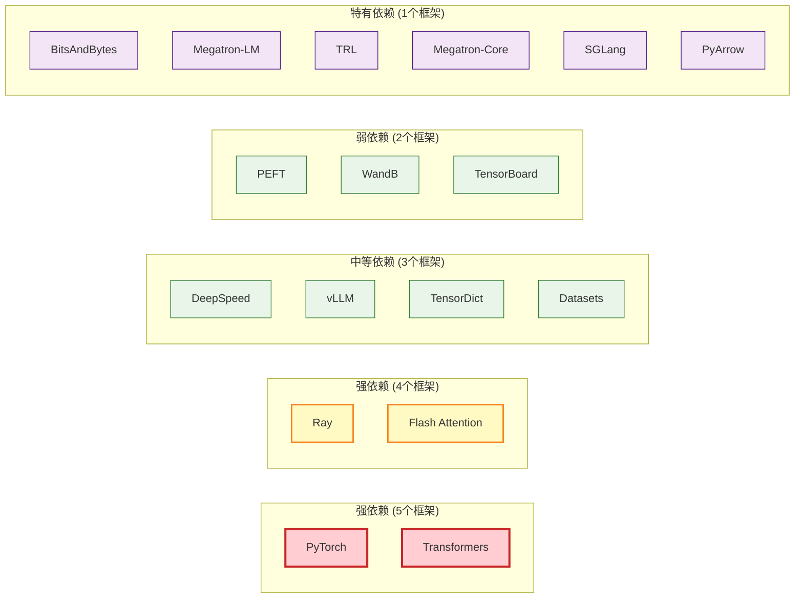

# 大语言模型训练框架依赖关系综合分析报告

## 概述

本报告分析了五个主流大语言模型训练框架的核心模块对基础库的依赖情况，包括：
- **OpenRLHF**: 基于Ray和vLLM的高性能RLHF框架
- **MindSpeed-RL**: 基于昇腾生态的强化学习加速框架
- **LLaMA-Factory**: 基于HuggingFace生态的完整训练框架
- **AReaL**: 完全异步强化学习训练系统
- **Verl**: 灵活的强化学习训练框架

## 共同依赖分析

### 1. 核心深度学习框架

#### PyTorch
- **使用框架**: 所有5个框架
- **用途**: 深度学习计算基础、张量操作、自动微分
- **依赖强度**: 强依赖（核心基础）

#### Transformers (HuggingFace)
- **使用框架**: OpenRLHF, MindSpeed-RL, LLaMA-Factory, AReaL, Verl
- **用途**: 预训练模型加载、tokenizer管理、模型配置
- **依赖强度**: 强依赖（模型管理核心）

### 2. 分布式计算框架

#### Ray
- **使用框架**: OpenRLHF, MindSpeed-RL, AReaL, Verl
- **用途**: 分布式任务调度、资源管理、Actor模式
- **依赖强度**: 强依赖（分布式训练核心）

#### DeepSpeed
- **使用框架**: OpenRLHF, LLaMA-Factory, AReaL
- **用途**: ZeRO优化、混合精度训练、内存优化
- **依赖强度**: 中等依赖（训练优化）

### 3. 推理加速库

#### vLLM
- **使用框架**: OpenRLHF, MindSpeed-RL, Verl
- **用途**: 高性能推理引擎、批处理优化
- **依赖强度**: 强依赖（推理核心）

#### Flash Attention
- **使用框架**: OpenRLHF, LLaMA-Factory, AReaL, Verl
- **用途**: 高效注意力计算、内存优化
- **依赖强度**: 中等依赖（性能优化）

### 4. 数据处理库

#### Datasets (HuggingFace)
- **使用框架**: OpenRLHF, LLaMA-Factory, AReaL
- **用途**: 数据集加载、预处理、多模态数据支持
- **依赖强度**: 中等依赖（数据处理）

#### TensorDict
- **使用框架**: MindSpeed-RL, AReaL, Verl
- **用途**: 统一数据结构管理、批处理、设备管理
- **依赖强度**: 强依赖（数据管理核心）

### 5. 参数高效微调

#### PEFT
- **使用框架**: OpenRLHF, LLaMA-Factory
- **用途**: LoRA、QLoRA等参数高效微调
- **依赖强度**: 中等依赖（模型优化）

## 非共同依赖分析

### 1. 框架特有依赖

#### OpenRLHF特有
- **BitsAndBytes**: 4-bit量化训练支持
- **TorchData**: PyTorch数据加载优化

#### MindSpeed-RL特有
- **Megatron-LM**: NVIDIA大规模模型并行框架
- **torch_npu**: 昇腾NPU适配
- **Hydra**: 配置管理框架

#### LLaMA-Factory特有
- **TRL**: Transformer Reinforcement Learning库
- **Accelerate**: HuggingFace分布式训练加速
- **AutoGPTQ/AutoAWQ/AQLM**: 多种量化方法
- **GaLore/APOLLO/BAdam**: 多种优化器

#### AReaL特有
- **Megatron-Core**: NVIDIA高性能训练框架
- **SGLang**: 高性能推理框架
- **Gymnasium**: 强化学习环境标准库
- **mbridge**: 模型桥接工具

#### Verl特有
- **PyArrow**: 高性能数据序列化
- **Liger Kernel**: 高性能内核库

### 2. 监控日志库

#### 共同使用
- **WandB**: 实验跟踪和可视化（MindSpeed-RL, Verl）
- **TensorBoard**: 训练可视化（MindSpeed-RL, Verl）

## 框架依赖关系图

```mermaid
graph TB
    %% 基础库节点
    subgraph "核心基础库"
        PT[PyTorch<br/>深度学习基础]
        TF[Transformers<br/>模型管理]
        RAY[Ray<br/>分布式计算]
        DS[DeepSpeed<br/>训练优化]
        VLLM[vLLM<br/>推理引擎]
        FA[Flash Attention<br/>注意力优化]
        TD[TensorDict<br/>数据结构]
        DAT[Datasets<br/>数据处理]
        PEFT[PEFT<br/>参数高效微调]
    end
    
    %% 框架节点
    subgraph "训练框架"
        ORL[OpenRLHF<br/>高性能RLHF]
        MSRL[MindSpeed-RL<br/>昇腾生态RL]
        LF[LLaMA-Factory<br/>HuggingFace生态]
        AREAL[AReaL<br/>异步RL训练]
        VERL[Verl<br/>灵活RL框架]
    end
    
    %% 特有依赖节点
    subgraph "特有依赖库"
        BB[BitsAndBytes<br/>量化训练]
        ML[Megatron-LM<br/>大规模并行]
        TRL[TRL<br/>强化学习]
        ACC[Accelerate<br/>分布式加速]
        MC[Megatron-Core<br/>高性能训练]
        SGL[SGLang<br/>推理框架]
        GYM[Gymnasium<br/>RL环境]
        PA[PyArrow<br/>数据序列化]
        LK[Liger Kernel<br/>高性能内核]
    end
    
    %% 共同依赖关系
    PT --> ORL
    PT --> MSRL
    PT --> LF
    PT --> AREAL
    PT --> VERL
    
    TF --> ORL
    TF --> MSRL
    TF --> LF
    TF --> AREAL
    TF --> VERL
    
    RAY --> ORL
    RAY --> MSRL
    RAY --> AREAL
    RAY --> VERL
    
    DS --> ORL
    DS --> LF
    DS --> AREAL
    
    VLLM --> ORL
    VLLM --> MSRL
    VLLM --> VERL
    
    FA --> ORL
    FA --> LF
    FA --> AREAL
    FA --> VERL
    
    TD --> MSRL
    TD --> AREAL
    TD --> VERL
    
    DAT --> ORL
    DAT --> LF
    DAT --> AREAL
    
    PEFT --> ORL
    PEFT --> LF
    
    %% 特有依赖关系
    BB --> ORL
    ML --> MSRL
    TRL --> LF
    ACC --> LF
    MC --> AREAL
    SGL --> AREAL
    GYM --> AREAL
    PA --> VERL
    LK --> VERL
    
    %% 样式定义
    classDef coreLib fill:#e1f5fe,stroke:#01579b,stroke-width:2px
    classDef framework fill:#f3e5f5,stroke:#4a148c,stroke-width:2px
    classDef uniqueLib fill:#fff3e0,stroke:#e65100,stroke-width:2px
    
    class PT,TF,RAY,DS,VLLM,FA,TD,DAT,PEFT coreLib
    class ORL,MSRL,LF,AREAL,VERL framework
    class BB,ML,TRL,ACC,MC,SGL,GYM,PA,LK uniqueLib
```

## 依赖强度分析图

## 模块依赖关系矩阵

| 基础库 | OpenRLHF | MindSpeed-RL | LLaMA-Factory | AReaL | Verl | 使用频率 |
|--------|----------|--------------|---------------|-------|------|----------|
| **PyTorch** | ✅ | ✅ | ✅ | ✅ | ✅ | 5/5 |
| **Transformers** | ✅ | ✅ | ✅ | ✅ | ✅ | 5/5 |
| **Ray** | ✅ | ✅ | ❌ | ✅ | ✅ | 4/5 |
| **Flash Attention** | ✅ | ❌ | ✅ | ✅ | ✅ | 4/5 |
| **DeepSpeed** | ✅ | ❌ | ✅ | ✅ | ❌ | 3/5 |
| **vLLM** | ✅ | ✅ | ❌ | ❌ | ✅ | 3/5 |
| **TensorDict** | ❌ | ✅ | ❌ | ✅ | ✅ | 3/5 |
| **Datasets** | ✅ | ❌ | ✅ | ✅ | ❌ | 3/5 |
| **PEFT** | ✅ | ❌ | ✅ | ❌ | ❌ | 2/5 |
| **WandB** | ❌ | ✅ | ❌ | ❌ | ✅ | 2/5 |
| **TensorBoard** | ❌ | ✅ | ❌ | ❌ | ✅ | 2/5 |

## 框架特性对比

### 1. 分布式训练能力
- **Ray生态**: OpenRLHF, MindSpeed-RL, AReaL, Verl
- **DeepSpeed生态**: OpenRLHF, LLaMA-Factory, AReaL
- **Megatron生态**: MindSpeed-RL, AReaL

### 2. 推理加速能力
- **vLLM**: OpenRLHF, MindSpeed-RL, Verl
- **SGLang**: AReaL
- **Flash Attention**: OpenRLHF, LLaMA-Factory, AReaL, Verl

### 3. 数据处理能力
- **TensorDict**: MindSpeed-RL, AReaL, Verl
- **Datasets**: OpenRLHF, LLaMA-Factory, AReaL
- **PyArrow**: Verl

### 4. 模型优化能力
- **PEFT**: OpenRLHF, LLaMA-Factory
- **量化支持**: OpenRLHF (BitsAndBytes), LLaMA-Factory (多种量化)
- **优化器**: LLaMA-Factory (多种优化器)

## 详细模块依赖分析

### OpenRLHF 模块依赖
- **分布式训练模块**: Ray, DeepSpeed, PyTorch Distributed
- **模型管理模块**: Transformers, PEFT, DeepSpeed
- **推理加速模块**: vLLM, Flash Attention, Transformers
- **训练算法模块**: PyTorch, Transformers, DeepSpeed
- **数据处理模块**: Datasets, TorchData, Transformers
- **优化器模块**: DeepSpeed, PyTorch
- **量化模块**: BitsAndBytes, PEFT
- **注意力机制模块**: Flash Attention, Transformers

### MindSpeed-RL 模块依赖
- **训练算法模块**: Ray, PyTorch, Transformers
- **推理引擎模块**: vLLM, Megatron-LM
- **数据处理模块**: TensorDict, Datasets
- **模型管理模块**: PyTorch, Transformers
- **分布式调度模块**: Ray
- **监控日志模块**: WandB, TensorBoard

### LLaMA-Factory 模块依赖
- **训练模块**: Transformers, Accelerate, TRL, DeepSpeed
- **模型模块**: Transformers, PEFT, Flash Attention
- **数据处理模块**: Datasets, Tokenizers
- **评估模块**: Datasets, Transformers
- **量化模块**: AutoGPTQ, AutoAWQ, AQLM
- **优化器模块**: GaLore, APOLLO, BAdam

### AReaL 模块依赖
- **训练引擎模块**: TensorDict, Ray, DeepSpeed, Megatron-Core, Transformers
- **数据加载模块**: TensorDict, Datasets, PyTorch Data
- **强化学习模块**: Gymnasium, TensorDict, PyTorch
- **分布式训练模块**: Ray, PyTorch Distributed
- **工作流模块**: TensorDict, SGLang, PyTorch

### Verl 模块依赖
- **数据管理模块**: TensorDict, PyArrow
- **分布式控制模块**: Ray, PyTorch Distributed
- **训练模块**: PyTorch, Transformers, Flash Attention
- **模型管理模块**: FSDP, Megatron-LM
- **推理模块**: vLLM, SGLang
- **算法模块**: Flash Attention, PyTorch
- **工具模块**: Liger Kernel, PyTorch

## 技术趋势分析

### 1. 模块化设计
所有框架都采用模块化架构，便于扩展和维护：
- **OpenRLHF**: 8个核心模块，职责清晰
- **MindSpeed-RL**: 6个核心模块，生态适配
- **LLaMA-Factory**: 4个核心模块，生态完整
- **AReaL**: 5个核心模块，异步设计
- **Verl**: 7个核心模块，灵活架构

### 2. 性能优化
普遍集成高性能组件：
- **Flash Attention**: 4个框架采用，成为注意力优化标准
- **vLLM**: 3个框架采用，推理加速主流选择
- **DeepSpeed**: 3个框架采用，训练优化重要工具

### 3. 生态集成
深度集成主流开源生态：
- **HuggingFace生态**: Transformers, Datasets, PEFT等
- **PyTorch生态**: PyTorch, TorchData, FSDP等
- **分布式生态**: Ray, DeepSpeed, Megatron等

### 4. 硬件适配
支持多种硬件平台：
- **GPU**: 所有框架
- **NPU**: MindSpeed-RL (昇腾)
- **多节点**: 所有框架

## 总结

### 共同依赖特点
1. **PyTorch和Transformers**是所有框架的基础，体现了HuggingFace生态的主导地位
2. **Ray**在分布式训练中占据重要地位，4个框架采用
3. **Flash Attention**成为注意力优化的标准选择，4个框架采用

### 差异化特点
1. **OpenRLHF**: 专注于RLHF，集成vLLM和DeepSpeed
2. **MindSpeed-RL**: 昇腾生态适配，使用Megatron-LM
3. **LLaMA-Factory**: HuggingFace生态完整集成，支持多种训练方法
4. **AReaL**: 异步RL训练，集成SGLang和Megatron-Core
5. **Verl**: 灵活架构，支持多种推理引擎

### 技术趋势
1. **模块化设计**: 各框架都采用模块化架构，便于扩展
2. **性能优化**: 普遍集成高性能组件（Flash Attention、vLLM等）
3. **生态集成**: 深度集成主流开源生态，避免重复造轮子
4. **硬件适配**: 支持多种硬件平台和推理引擎

这种依赖分析为框架选择和架构设计提供了重要参考，有助于理解各框架的技术特点和适用场景。

## 信源

本分析基于以下信源：
1. **OpenRLHF**: deps-analysis/OpenRLHF-deps-analysis.md
2. **MindSpeed-RL**: deps-analysis/MindSpeed-RL-deps-analysis.md
3. **LLaMA-Factory**: deps-analysis/LLaMA-Factory-deps-analysis.md
4. **AReaL**: deps-analysis/AReaL-deps-analysis.md
5. **Verl**: deps-analysis/verl-deps-analysis.md
