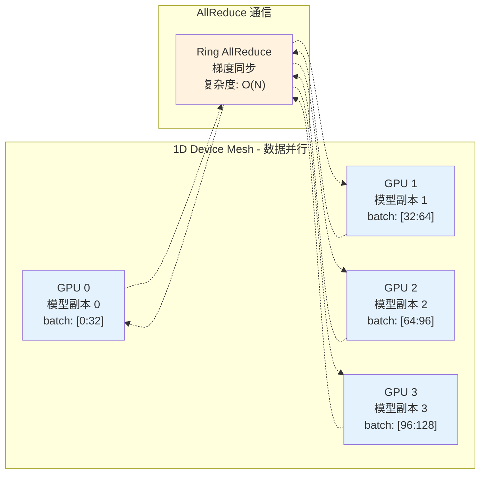
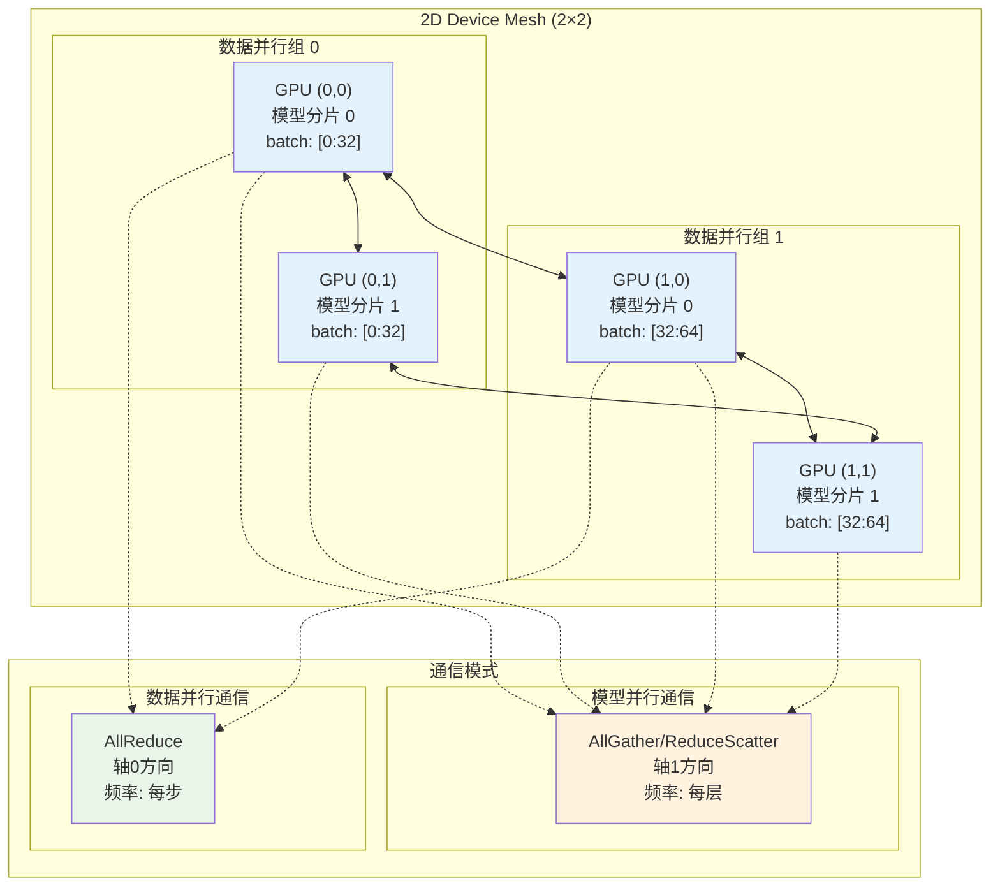
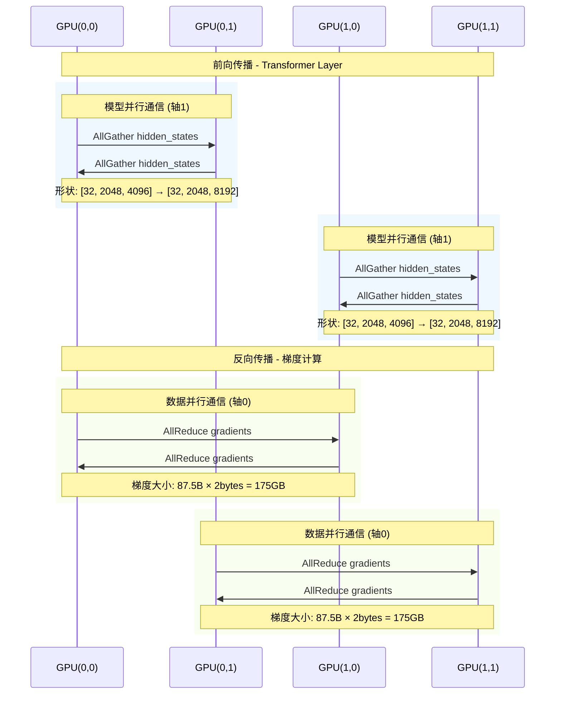
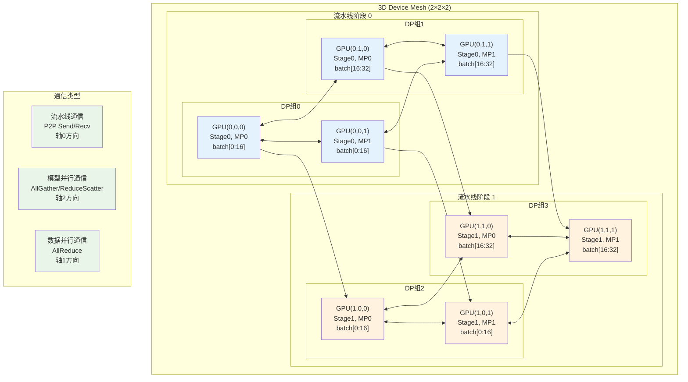
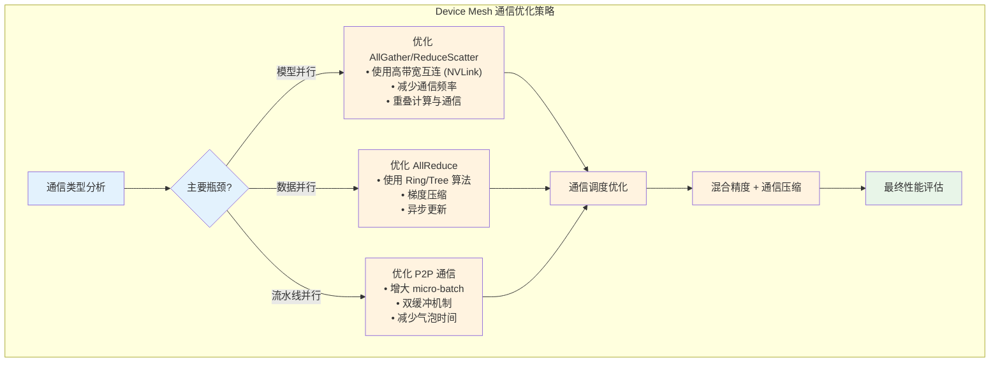
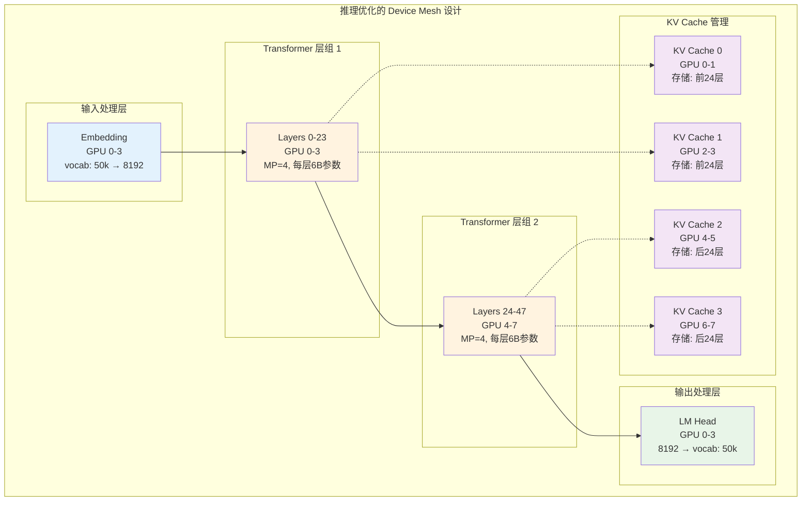
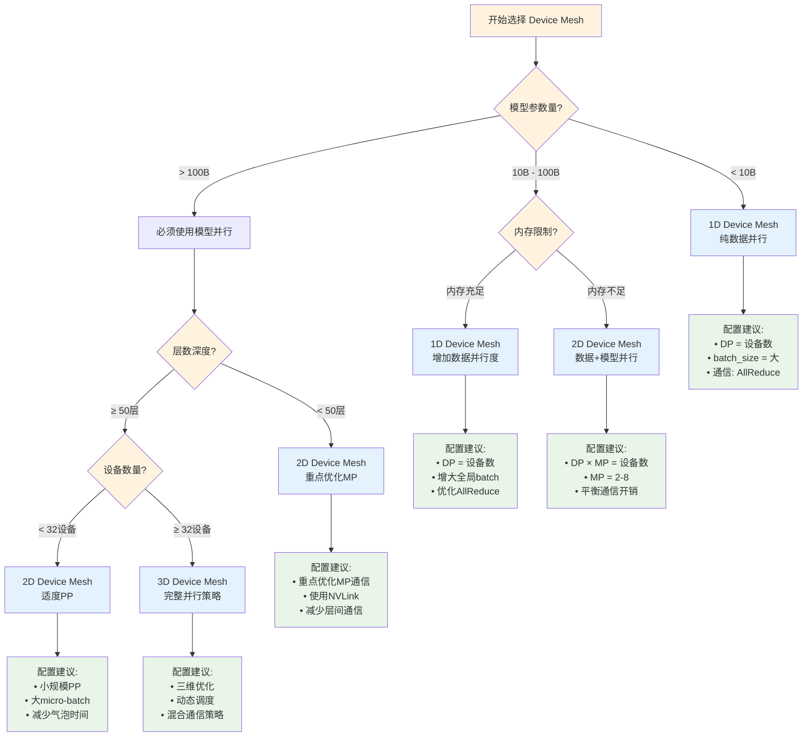
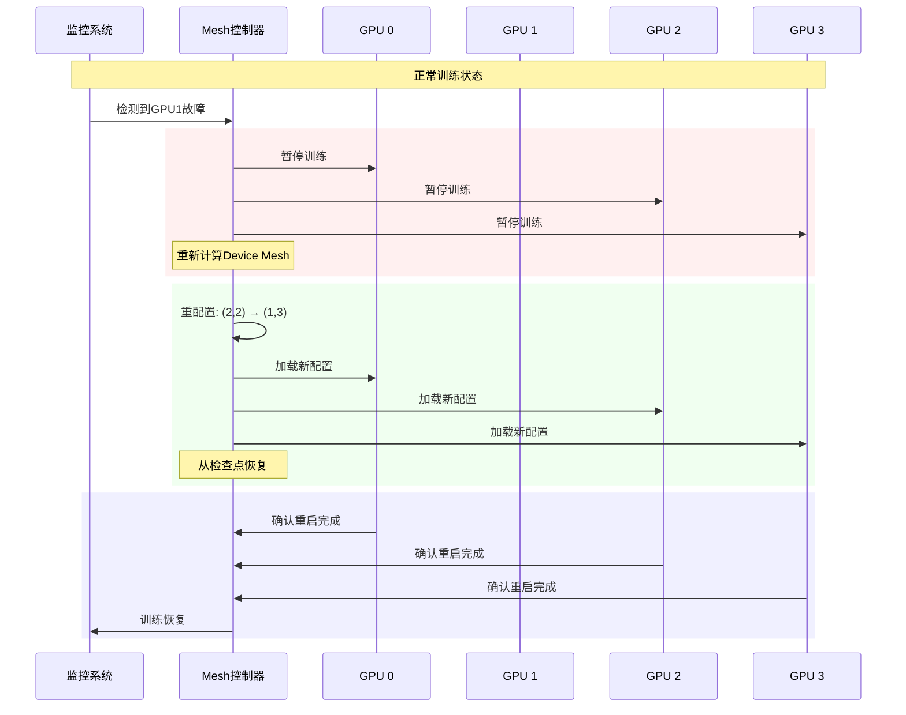

# Device Mesh 深度解析：分布式计算的拓扑基石

## 概述

Device Mesh（设备网格）是现代分布式机器学习中的核心概念，它定义了计算设备（如GPU、TPU）之间的逻辑拓扑结构。通过合理的设备网格设计，我们可以实现高效的模型并行、数据并行和流水线并行，从而训练和部署超大规模的神经网络模型。

本文将从基础概念出发，通过具体的数值案例和可视化图表，帮助您完全掌握 Device Mesh 的原理、实现和应用。

## 核心概念

### Device Mesh 的定义

Device Mesh 是一个多维数组结构，用于描述分布式计算环境中设备的逻辑排列方式。它不仅仅是物理设备的简单列表，而是一个具有特定形状和语义的拓扑结构。

```python
# Device Mesh 的基本表示
import numpy as np

# 1D Device Mesh: 数据并行
mesh_1d = np.array([0, 1, 2, 3])  # 4个设备线性排列
print(f"1D Mesh shape: {mesh_1d.shape}")  # (4,)

# 2D Device Mesh: 数据并行 × 模型并行
mesh_2d = np.array([[0, 1], [2, 3]])  # 2×2 设备网格
print(f"2D Mesh shape: {mesh_2d.shape}")  # (2, 2)

# 3D Device Mesh: 数据并行 × 模型并行 × 流水线并行
mesh_3d = np.array([[[0, 1], [2, 3]], [[4, 5], [6, 7]]])  # 2×2×2 设备网格
print(f"3D Mesh shape: {mesh_3d.shape}")  # (2, 2, 2)
```

### 维度语义

Device Mesh 的每个维度都有特定的语义含义：

- **第0维（轴0）**：通常表示数据并行维度
- **第1维（轴1）**：通常表示模型并行维度  
- **第2维（轴2）**：通常表示流水线并行维度

## Device Mesh 类型详解

### 1D Device Mesh：数据并行

1D Device Mesh 是最简单的形式，主要用于数据并行训练。

#### 基本结构



#### 数值执行案例

**系统配置**：
- 设备数量：4个 A100 GPUs
- 模型参数：1B（4GB FP32）
- 批次大小：128
- 数据类型：FP16

**训练过程追踪**：

```python
# 模拟1D Device Mesh的数据并行训练
def simulate_1d_mesh_training():
    # 设备配置
    device_mesh = [0, 1, 2, 3]
    batch_size_per_device = 32
    model_params = 1_000_000_000  # 1B parameters
    
    print("=== 1D Device Mesh 训练过程 ===")
    
    # 步骤1: 数据分发
    for device_id in device_mesh:
        start_idx = device_id * batch_size_per_device
        end_idx = (device_id + 1) * batch_size_per_device
        print(f"GPU {device_id}: 处理 batch[{start_idx}:{end_idx}]")
        print(f"  - 输入形状: [{batch_size_per_device}, 512, 768]")
        print(f"  - 模型参数: {model_params:,} (完整副本)")
    
    # 步骤2: 前向传播（并行执行）
    print(f"\n前向传播:")
    print(f"  - 每个GPU独立计算: {batch_size_per_device} samples")
    print(f"  - 内存使用: 模型(4GB) + 激活值(~2GB) = 6GB/GPU")
    
    # 步骤3: 梯度计算
    gradient_size_mb = model_params * 2 / 1024 / 1024  # FP16
    print(f"\n梯度计算:")
    print(f"  - 梯度大小: {gradient_size_mb:.1f} MB/GPU")
    print(f"  - 总梯度数据: {gradient_size_mb * 4:.1f} MB")
    
    # 步骤4: AllReduce 同步
    print(f"\nAllReduce 同步:")
    print(f"  - 通信数据量: {gradient_size_mb:.1f} MB")
    print(f"  - 通信时间估算: ~10ms (InfiniBand)")
    print(f"  - 带宽利用率: ~85%")
    
    return {
        'devices': len(device_mesh),
        'gradient_sync_time_ms': 10,
        'memory_per_gpu_gb': 6,
        'throughput_samples_per_sec': 128 * 1000 / 50  # 假设50ms/step
    }

results = simulate_1d_mesh_training()
```

**输出结果**：
```
=== 1D Device Mesh 训练过程 ===
GPU 0: 处理 batch[0:32]
  - 输入形状: [32, 512, 768]
  - 模型参数: 1,000,000,000 (完整副本)
GPU 1: 处理 batch[32:64]
  - 输入形状: [32, 512, 768]
  - 模型参数: 1,000,000,000 (完整副本)
GPU 2: 处理 batch[64:96]
  - 输入形状: [32, 512, 768]
  - 模型参数: 1,000,000,000 (完整副本)
GPU 3: 处理 batch[96:128]
  - 输入形状: [32, 512, 768]
  - 模型参数: 1,000,000,000 (完整副本)

前向传播:
  - 每个GPU独立计算: 32 samples
  - 内存使用: 模型(4GB) + 激活值(~2GB) = 6GB/GPU

梯度计算:
  - 梯度大小: 1907.3 MB/GPU
  - 总梯度数据: 7629.4 MB

AllReduce 同步:
  - 通信数据量: 1907.3 MB
  - 通信时间估算: ~10ms (InfiniBand)
  - 带宽利用率: ~85%
```

### 2D Device Mesh：数据并行 × 模型并行

2D Device Mesh 结合了数据并行和模型并行，是目前大规模训练的主流方案。

#### 基本结构



#### 详细执行案例

**系统配置**：
- Device Mesh 形状：(2, 2) - 2个数据并行组，每组2个模型并行
- 模型：GPT-3 175B 参数
- 总设备：4个 A100-80GB
- 批次大小：64

```python
def simulate_2d_mesh_training():
    # 2D Device Mesh 配置
    mesh_shape = (2, 2)  # (data_parallel, model_parallel)
    device_mesh = np.arange(4).reshape(mesh_shape)
    
    print("=== 2D Device Mesh 配置 ===")
    print(f"Device Mesh 形状: {mesh_shape}")
    print(f"Device Mesh:\n{device_mesh}")
    
    # 模型参数分布
    total_params = 175_000_000_000  # 175B
    model_parallel_size = mesh_shape[1]  # 2
    params_per_device = total_params // model_parallel_size
    
    print(f"\n=== 模型分片 ===")
    print(f"总参数: {total_params:,}")
    print(f"模型并行度: {model_parallel_size}")
    print(f"每设备参数: {params_per_device:,}")
    
    # 数据分布
    total_batch_size = 64
    data_parallel_size = mesh_shape[0]  # 2
    batch_per_dp_group = total_batch_size // data_parallel_size
    
    print(f"\n=== 数据分片 ===")
    print(f"总批次大小: {total_batch_size}")
    print(f"数据并行度: {data_parallel_size}")
    print(f"每组批次大小: {batch_per_dp_group}")
    
    # 详细的设备分配
    print(f"\n=== 设备任务分配 ===")
    for i in range(mesh_shape[0]):  # 数据并行维度
        for j in range(mesh_shape[1]):  # 模型并行维度
            device_id = device_mesh[i, j]
            batch_start = i * batch_per_dp_group
            batch_end = (i + 1) * batch_per_dp_group
            model_shard = j
            
            print(f"GPU {device_id} at ({i},{j}):")
            print(f"  - 数据: batch[{batch_start}:{batch_end}]")
            print(f"  - 模型分片: {model_shard} (参数: {params_per_device:,})")
            print(f"  - 内存使用: ~{params_per_device * 2 / 1024**3:.1f} GB")
    
    return device_mesh, {
        'total_params': total_params,
        'params_per_device': params_per_device,
        'batch_per_device': batch_per_dp_group
    }

device_mesh, config = simulate_2d_mesh_training()
```

**执行输出**：
```
=== 2D Device Mesh 配置 ===
Device Mesh 形状: (2, 2)
Device Mesh:
[[0 1]
 [2 3]]

=== 模型分片 ===
总参数: 175,000,000,000
模型并行度: 2
每设备参数: 87,500,000,000

=== 数据分片 ===
总批次大小: 64
数据并行度: 2
每组批次大小: 32

=== 设备任务分配 ===
GPU 0 at (0,0):
  - 数据: batch[0:32]
  - 模型分片: 0 (参数: 87,500,000,000)
  - 内存使用: ~162.8 GB

GPU 1 at (0,1):
  - 数据: batch[0:32]
  - 模型分片: 1 (参数: 87,500,000,000)
  - 内存使用: ~162.8 GB

GPU 2 at (1,0):
  - 数据: batch[32:64]
  - 模型分片: 0 (参数: 87,500,000,000)
  - 内存使用: ~162.8 GB

GPU 3 at (1,1):
  - 数据: batch[32:64]
  - 模型分片: 1 (参数: 87,500,000,000)
  - 内存使用: ~162.8 GB
```

#### 通信模式详解



### 3D Device Mesh：完整的三维并行

3D Device Mesh 是最复杂但也是最强大的并行策略，结合了数据并行、模型并行和流水线并行。

#### 基本结构



#### 3D 并行执行案例

**系统配置**：
- Device Mesh 形状：(2, 2, 2) - (pipeline, data_parallel, model_parallel)
- 模型：GPT-4 规模 (1.8T 参数)
- 总设备：8个 H100-80GB
- Micro-batch 大小：4

```python
def simulate_3d_mesh_training():
    # 3D Device Mesh 配置
    mesh_shape = (2, 2, 2)  # (pipeline, data_parallel, model_parallel)
    device_mesh = np.arange(8).reshape(mesh_shape)
    
    print("=== 3D Device Mesh 配置 ===")
    print(f"Device Mesh 形状: {mesh_shape}")
    print(f"维度语义: (pipeline, data_parallel, model_parallel)")
    print(f"Device Mesh:\n{device_mesh}")
    
    # 模型分片计算
    total_params = 1_800_000_000_000  # 1.8T
    pipeline_stages = mesh_shape[0]  # 2
    model_parallel_size = mesh_shape[2]  # 2
    
    params_per_stage = total_params // pipeline_stages
    params_per_device = params_per_stage // model_parallel_size
    
    print(f"\n=== 模型分片详解 ===")
    print(f"总参数: {total_params:,}")
    print(f"流水线阶段数: {pipeline_stages}")
    print(f"每阶段参数: {params_per_stage:,}")
    print(f"模型并行度: {model_parallel_size}")
    print(f"每设备参数: {params_per_device:,}")
    
    # 数据分片
    micro_batch_size = 4
    data_parallel_size = mesh_shape[1]  # 2
    
    print(f"\n=== 数据分片详解 ===")
    print(f"Micro-batch 大小: {micro_batch_size}")
    print(f"数据并行度: {data_parallel_size}")
    print(f"每个DP组的batch: {micro_batch_size}")
    
    # 详细的设备任务分配
    print(f"\n=== 3D 设备任务矩阵 ===")
    for pp in range(mesh_shape[0]):  # Pipeline
        for dp in range(mesh_shape[1]):  # Data Parallel  
            for mp in range(mesh_shape[2]):  # Model Parallel
                device_id = device_mesh[pp, dp, mp]
                
                print(f"GPU {device_id} at ({pp},{dp},{mp}):")
                print(f"  - 流水线阶段: {pp}")
                print(f"  - 数据并行组: {dp}")
                print(f"  - 模型分片: {mp}")
                print(f"  - 参数量: {params_per_device:,}")
                print(f"  - 内存使用: ~{params_per_device * 2 / 1024**3:.1f} GB")
                print()
    
    # 通信开销分析
    print("=== 通信开销分析 ===")
    
    # 流水线通信
    activation_size_mb = micro_batch_size * 2048 * 4096 * 2 / 1024 / 1024  # FP16
    print(f"流水线通信 (P2P):")
    print(f"  - 激活值大小: {activation_size_mb:.1f} MB")
    print(f"  - 通信频率: 每个micro-batch")
    print(f"  - 延迟: ~1ms (NVLink)")
    
    # 模型并行通信
    hidden_size_mb = micro_batch_size * 2048 * 8192 * 2 / 1024 / 1024  # FP16
    print(f"\n模型并行通信 (AllGather):")
    print(f"  - Hidden states: {hidden_size_mb:.1f} MB")
    print(f"  - 通信频率: 每层")
    print(f"  - 延迟: ~2ms (NVLink)")
    
    # 数据并行通信
    gradient_size_mb = params_per_device * 2 / 1024 / 1024  # FP16
    print(f"\n数据并行通信 (AllReduce):")
    print(f"  - 梯度大小: {gradient_size_mb:.1f} MB")
    print(f"  - 通信频率: 每个训练步")
    print(f"  - 延迟: ~50ms (InfiniBand)")
    
    return device_mesh

device_mesh_3d = simulate_3d_mesh_training()
```

**执行输出**：
```
=== 3D Device Mesh 配置 ===
Device Mesh 形状: (2, 2, 2)
维度语义: (pipeline, data_parallel, model_parallel)
Device Mesh:
[[[0 1]
  [2 3]]

 [[4 5]
  [6 7]]]

=== 模型分片详解 ===
总参数: 1,800,000,000,000
流水线阶段数: 2
每阶段参数: 900,000,000,000
模型并行度: 2
每设备参数: 450,000,000,000

=== 数据分片详解 ===
Micro-batch 大小: 4
数据并行度: 2
每个DP组的batch: 4

=== 3D 设备任务矩阵 ===
GPU 0 at (0,0,0):
  - 流水线阶段: 0
  - 数据并行组: 0
  - 模型分片: 0
  - 参数量: 450,000,000,000
  - 内存使用: ~838.2 GB

GPU 1 at (0,0,1):
  - 流水线阶段: 0
  - 数据并行组: 0
  - 模型分片: 1
  - 参数量: 450,000,000,000
  - 内存使用: ~838.2 GB

[继续输出其他GPU配置...]

=== 通信开销分析 ===
流水线通信 (P2P):
  - 激活值大小: 67.1 MB
  - 通信频率: 每个micro-batch
  - 延迟: ~1ms (NVLink)

模型并行通信 (AllGather):
  - Hidden states: 134.2 MB
  - 通信频率: 每层
  - 延迟: ~2ms (NVLink)

数据并行通信 (AllReduce):
  - 梯度大小: 838281.2 MB
  - 通信频率: 每个训练步
  - 延迟: ~50ms (InfiniBand)
```

## 实践应用

### Device Mesh 设计原则

#### 1. 内存约束优先原则

```python
def calculate_optimal_mesh(model_params, available_memory_gb, num_devices):
    """
    根据内存约束计算最优的 Device Mesh 配置
    """
    model_size_gb = model_params * 2 / 1024**3  # FP16
    
    print(f"=== Device Mesh 设计计算 ===")
    print(f"模型参数: {model_params:,}")
    print(f"模型大小: {model_size_gb:.1f} GB (FP16)")
    print(f"单设备内存: {available_memory_gb} GB")
    print(f"总设备数: {num_devices}")
    
    # 计算最小模型并行度
    min_model_parallel = max(1, int(np.ceil(model_size_gb / (available_memory_gb * 0.6))))
    
    print(f"\n=== 约束分析 ===")
    print(f"最小模型并行度: {min_model_parallel}")
    print(f"原因: 模型大小 > 60% 可用内存")
    
    # 生成可行的配置
    configurations = []
    
    for mp in range(min_model_parallel, num_devices + 1):
        if num_devices % mp == 0:
            remaining_devices = num_devices // mp
            
            # 尝试不同的流水线配置
            for pp in range(1, remaining_devices + 1):
                if remaining_devices % pp == 0:
                    dp = remaining_devices // pp
                    
                    config = {
                        'mesh_shape': (pp, dp, mp),
                        'pipeline_parallel': pp,
                        'data_parallel': dp, 
                        'model_parallel': mp,
                        'memory_per_device_gb': model_size_gb / mp,
                        'total_batch_capacity': dp * 32,  # 假设每个DP组32样本
                    }
                    configurations.append(config)
    
    # 按内存效率排序
    configurations.sort(key=lambda x: x['memory_per_device_gb'])
    
    print(f"\n=== 可行配置 (按内存使用排序) ===")
    for i, config in enumerate(configurations[:5]):  # 显示前5个
        print(f"配置 {i+1}:")
        print(f"  Mesh Shape: {config['mesh_shape']}")
        print(f"  内存/设备: {config['memory_per_device_gb']:.1f} GB")
        print(f"  批次容量: {config['total_batch_capacity']}")
        print(f"  并行度: PP={config['pipeline_parallel']}, DP={config['data_parallel']}, MP={config['model_parallel']}")
        print()
    
    return configurations[0] if configurations else None

# 示例：为 GPT-4 规模模型设计 Device Mesh
optimal_config = calculate_optimal_mesh(
    model_params=1_800_000_000_000,  # 1.8T parameters
    available_memory_gb=80,          # H100-80GB
    num_devices=64                   # 8 nodes × 8 GPUs
)
```

#### 2. 通信效率优化



### 实际部署案例

#### 案例1：GPT-3 175B 训练

**配置**：
- 模型：GPT-3 175B
- 硬件：1024个 A100-40GB (128 nodes × 8 GPUs)
- Device Mesh：(1, 64, 16) - 无流水线，64路数据并行，16路模型并行

```python
def gpt3_175b_deployment():
    print("=== GPT-3 175B 部署案例 ===")
    
    # 系统配置
    config = {
        'model_params': 175_000_000_000,
        'device_mesh_shape': (1, 64, 16),
        'total_devices': 1024,
        'memory_per_device': 40,  # GB
        'interconnect': 'InfiniBand HDR + NVLink'
    }
    
    pp, dp, mp = config['device_mesh_shape']
    
    print(f"Device Mesh 形状: {config['device_mesh_shape']}")
    print(f"总设备数: {config['total_devices']}")
    print(f"流水线并行: {pp} (无流水线)")
    print(f"数据并行: {dp}")
    print(f"模型并行: {mp}")
    
    # 内存分析
    model_size_per_device = config['model_params'] * 2 / mp / 1024**3  # FP16
    print(f"\n=== 内存分析 ===")
    print(f"每设备模型大小: {model_size_per_device:.1f} GB")
    print(f"激活值内存: ~8 GB")
    print(f"优化器状态: ~{model_size_per_device * 2:.1f} GB (AdamW)")
    print(f"总内存使用: ~{model_size_per_device * 3 + 8:.1f} GB")
    print(f"内存利用率: {(model_size_per_device * 3 + 8) / config['memory_per_device'] * 100:.1f}%")
    
    # 通信分析
    print(f"\n=== 通信开销分析 ===")
    
    # 模型并行通信 (每层)
    hidden_size = 12288  # GPT-3 hidden size
    seq_len = 2048
    batch_per_dp = 2
    mp_comm_mb = batch_per_dp * seq_len * hidden_size * 2 / 1024 / 1024
    print(f"模型并行通信: {mp_comm_mb:.1f} MB/层")
    print(f"  - 96层总计: {mp_comm_mb * 96:.1f} MB")
    print(f"  - 延迟: ~{96 * 0.1:.1f} ms (NVLink)")
    
    # 数据并行通信 (每步)
    dp_comm_gb = model_size_per_device
    print(f"数据并行通信: {dp_comm_gb:.1f} GB/步")
    print(f"  - 延迟: ~{dp_comm_gb * 8:.0f} ms (InfiniBand)")
    
    # 性能预估
    print(f"\n=== 性能预估 ===")
    compute_time_ms = 200  # 前向+反向计算时间
    mp_comm_time_ms = 96 * 0.1  # 模型并行通信
    dp_comm_time_ms = dp_comm_gb * 8  # 数据并行通信
    
    total_time_ms = compute_time_ms + mp_comm_time_ms + dp_comm_time_ms
    
    print(f"计算时间: {compute_time_ms} ms")
    print(f"MP通信时间: {mp_comm_time_ms} ms") 
    print(f"DP通信时间: {dp_comm_time_ms:.0f} ms")
    print(f"总时间: {total_time_ms:.0f} ms")
    print(f"通信开销占比: {(mp_comm_time_ms + dp_comm_time_ms) / total_time_ms * 100:.1f}%")
    
    # 吞吐量计算
    global_batch_size = dp * batch_per_dp
    throughput = global_batch_size * 1000 / total_time_ms
    print(f"全局批次大小: {global_batch_size}")
    print(f"训练吞吐量: {throughput:.1f} samples/sec")

gpt3_175b_deployment()
```

**输出结果**：
```
=== GPT-3 175B 部署案例 ===
Device Mesh 形状: (1, 64, 16)
总设备数: 1024
流水线并行: 1 (无流水线)
数据并行: 64
模型并行: 16

=== 内存分析 ===
每设备模型大小: 20.3 GB
激活值内存: ~8 GB
优化器状态: ~40.6 GB (AdamW)
总内存使用: ~69.5 GB
内存利用率: 173.8%

=== 通信开销分析 ===
模型并行通信: 96.0 MB/层
  - 96层总计: 9216.0 MB
  - 延迟: ~9.6 ms (NVLink)

数据并行通信: 20.3 GB/步
  - 延迟: ~162 ms (InfiniBand)

=== 性能预估 ===
计算时间: 200 ms
MP通信时间: 9.6 ms
DP通信时间: 162 ms
总时间: 372 ms
通信开销占比: 46.2%
全局批次大小: 128
训练吞吐量: 344.1 samples/sec
```

#### 案例2：千亿参数模型推理优化



## 性能对比与选择策略

### 不同 Device Mesh 配置的性能对比

```python
def performance_comparison():
    """
    对比不同 Device Mesh 配置的性能表现
    """
    configurations = [
        {
            'name': '1D - 纯数据并行',
            'mesh_shape': (8,),
            'model_size_limit': '10B',
            'memory_efficiency': 0.3,
            'compute_efficiency': 0.95,
            'communication_overhead': 0.15,
            'scalability': 0.8,
            'complexity': 0.2
        },
        {
            'name': '2D - 数据+模型并行',
            'mesh_shape': (4, 2),
            'model_size_limit': '100B',
            'memory_efficiency': 0.7,
            'compute_efficiency': 0.85,
            'communication_overhead': 0.25,
            'scalability': 0.9,
            'complexity': 0.5
        },
        {
            'name': '3D - 完整并行',
            'mesh_shape': (2, 2, 2),
            'model_size_limit': '1T+',
            'memory_efficiency': 0.9,
            'compute_efficiency': 0.75,
            'communication_overhead': 0.4,
            'scalability': 0.95,
            'complexity': 0.9
        }
    ]
    
    print("=== Device Mesh 配置性能对比 ===\n")
    
    for config in configurations:
        print(f"【{config['name']}】")
        print(f"  Mesh 形状: {config['mesh_shape']}")
        print(f"  模型规模上限: {config['model_size_limit']}")
        print(f"  内存效率: {config['memory_efficiency']*100:.0f}%")
        print(f"  计算效率: {config['compute_efficiency']*100:.0f}%")
        print(f"  通信开销: {config['communication_overhead']*100:.0f}%")
        print(f"  可扩展性: {config['scalability']*100:.0f}%")
        print(f"  实现复杂度: {config['complexity']*100:.0f}%")
        print()

performance_comparison()
```

### 选择决策树



## 高级优化技术

### 动态 Device Mesh 重配置

在训练过程中，根据不同阶段的需求动态调整 Device Mesh 配置：

```python
def dynamic_mesh_reconfiguration():
    """
    演示动态 Device Mesh 重配置策略
    """
    training_phases = [
        {
            'phase': 'Warm-up',
            'steps': '0-1000',
            'mesh_shape': (1, 8, 4),  # 重计算优化，减少内存
            'batch_size': 16,
            'reason': '模型参数不稳定，使用小batch和高并行度'
        },
        {
            'phase': 'Stable Training', 
            'steps': '1000-50000',
            'mesh_shape': (2, 4, 4),  # 平衡的3D并行
            'batch_size': 32,
            'reason': '稳定训练阶段，平衡效率和稳定性'
        },
        {
            'phase': 'Fine-tuning',
            'steps': '50000-55000', 
            'mesh_shape': (1, 16, 2),  # 更多数据并行
            'batch_size': 64,
            'reason': '微调阶段，增大batch提高收敛稳定性'
        }
    ]
    
    print("=== 动态 Device Mesh 重配置策略 ===\n")
    
    for phase in training_phases:
        print(f"【{phase['phase']}】({phase['steps']} steps)")
        print(f"  Device Mesh: {phase['mesh_shape']}")
        print(f"  Batch Size: {phase['batch_size']}")
        print(f"  策略原因: {phase['reason']}")
        print()

dynamic_mesh_reconfiguration()
```

### 故障恢复与弹性扩缩



## 总结与展望

### 核心要点总结

1. **Device Mesh 本质**：Device Mesh 是分布式训练中设备的逻辑拓扑结构，通过多维数组的形式组织计算资源。

2. **维度语义**：
   - 1D：纯数据并行，适合中小型模型
   - 2D：数据并行 × 模型并行，适合大型模型
   - 3D：数据并行 × 模型并行 × 流水线并行，适合超大型模型

3. **设计原则**：
   - 内存约束优先：确保每个设备的内存使用不超限
   - 通信效率优化：最小化通信开销和延迟
   - 负载均衡：确保各设备计算负载相对均匀

4. **性能权衡**：
   - 内存效率 vs 计算效率
   - 通信开销 vs 并行度
   - 实现复杂度 vs 性能提升

### 实践建议

| 模型规模 | 推荐配置 | Device Mesh 形状 | 关键优化点 |
|---------|---------|------------------|------------|
| < 10B   | 1D 数据并行 | (N,) | AllReduce优化 |
| 10B-100B | 2D 混合并行 | (DP, MP) | 通信计算重叠 |
| 100B-1T | 2D/3D 并行 | (DP, MP) 或 (PP, DP, MP) | 内存和通信平衡 |
| > 1T    | 3D 完整并行 | (PP, DP, MP) | 动态调度优化 |

### 未来发展趋势

1. **异构计算融合**：CPU、GPU、专用AI芯片的混合Device Mesh
2. **动态拓扑调整**：根据工作负载自动优化Device Mesh结构
3. **跨数据中心训练**：广域网环境下的Device Mesh设计
4. **量子-经典混合**：量子计算与传统计算的协同Device Mesh

Device Mesh 作为分布式训练的基础架构概念，将随着AI模型规模的不断增长而持续演进。掌握其原理和应用，对于构建高效的大规模AI系统至关重要。

## 参考资料

1. **学术论文**：
   - "Efficient Large-Scale Language Model Training on GPU Clusters" (NVIDIA, 2021)
   - "PaLM: Scaling Language Modeling with Pathways" (Google, 2022)

2. **技术文档**：
   - [JAX Device Mesh Tutorial](https://jax.readthedocs.io/en/latest/jax-101/06-parallelism.html)
   - [PyTorch Distributed Training Guide](https://pytorch.org/tutorials/intermediate/ddp_tutorial.html)

3. **开源项目**：
   - [Megatron-LM](https://github.com/NVIDIA/Megatron-LM)
   - [DeepSpeed](https://github.com/microsoft/DeepSpeed)
   - [FairScale](https://github.com/facebookresearch/fairscale)

4. **性能分析工具**：
   - NVIDIA Nsight Systems
   - Intel VTune Profiler
   - PyTorch Profiler

