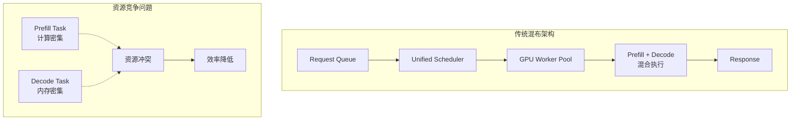
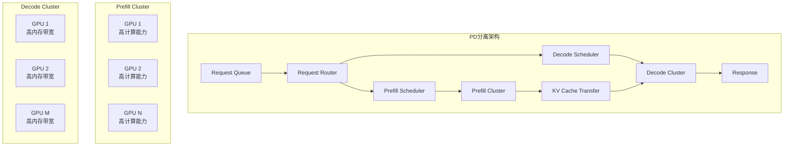
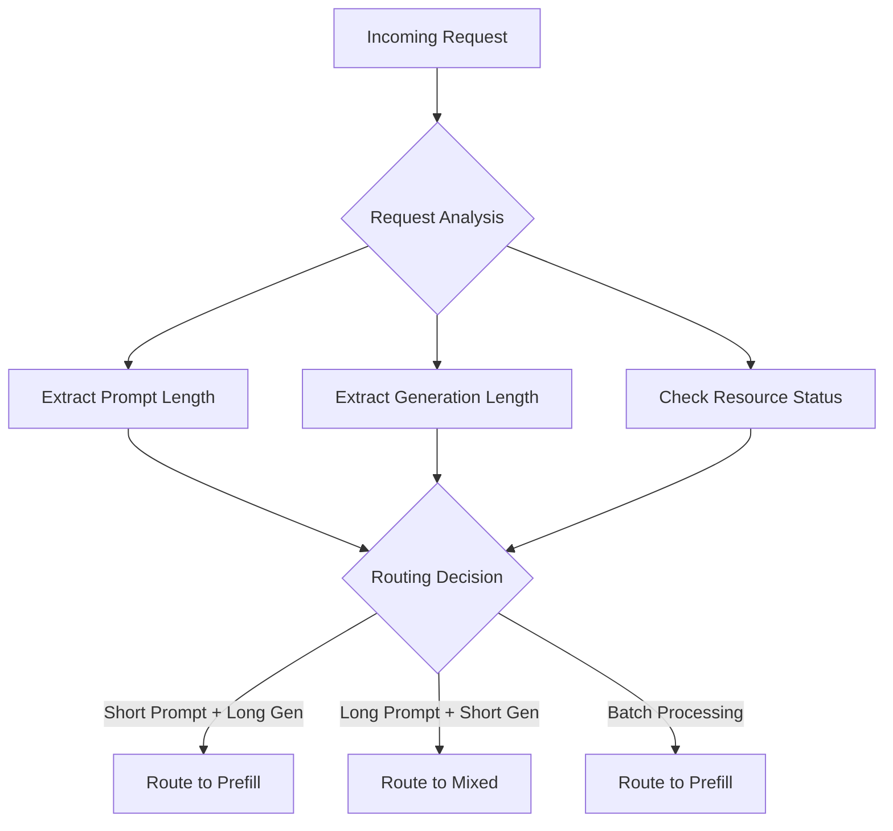
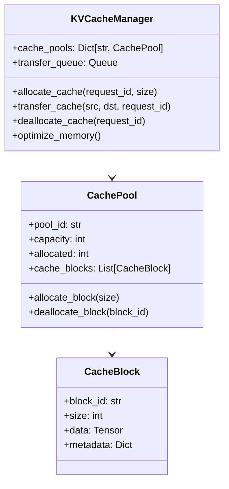
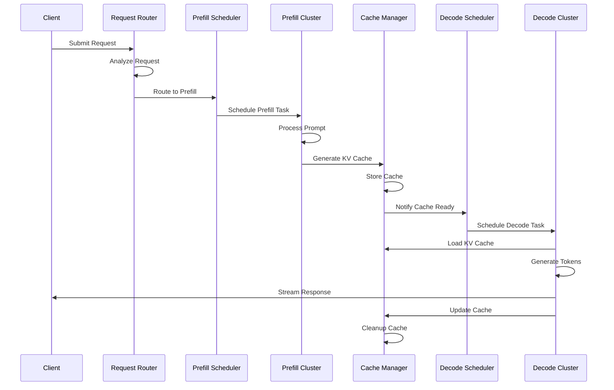
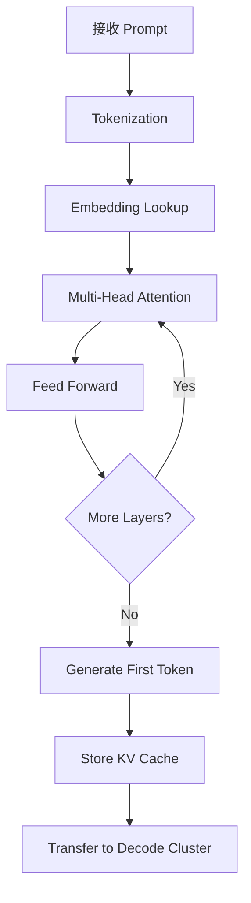
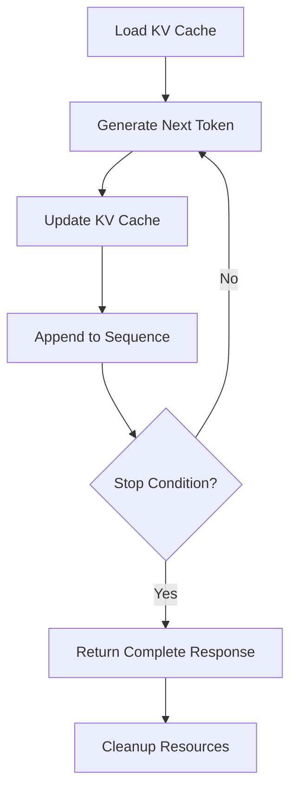
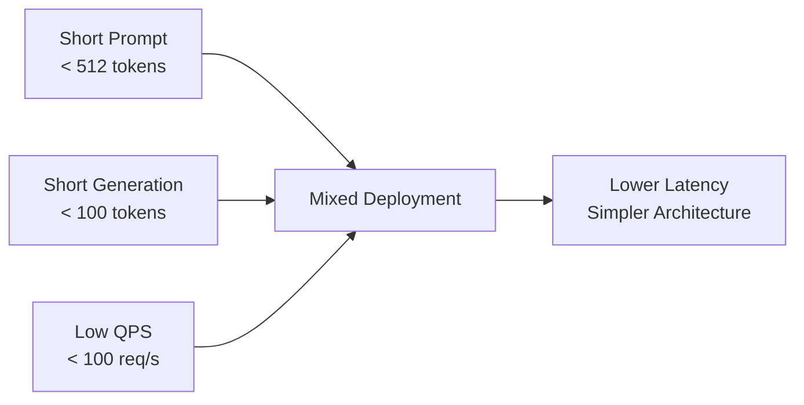
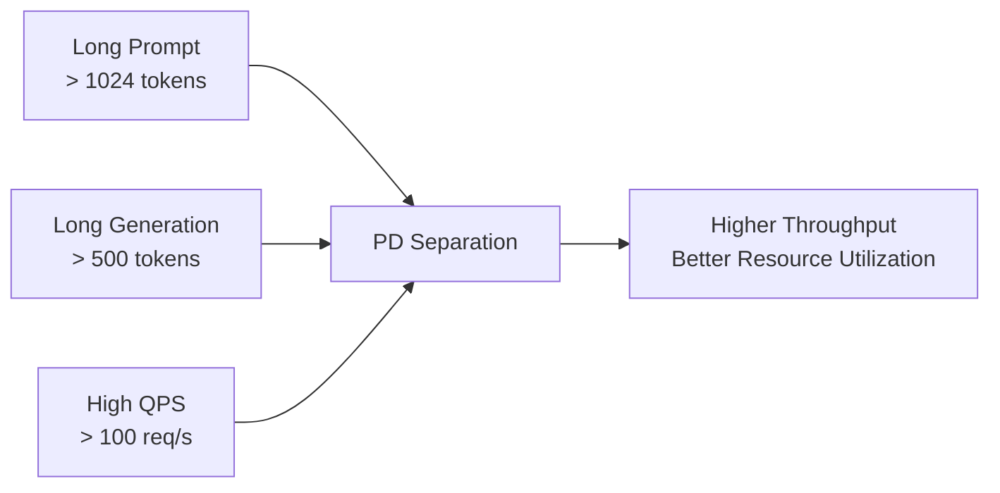

# vLLM Prefill/Decode Separation: Architecture and Mathematical Principles

## 概述

vLLM 的 prefill/decode (PD) 分离是大语言模型推理优化的重要技术创新。该方案将 LLM 推理过程分为两个不同的阶段：prefill（预填充）和 decode（解码），通过分离这两个阶段的计算和资源调度，显著提升了推理效率和资源利用率。

本文将从数学原理、架构设计、实现细节和应用场景等多个维度，深入解析 PD 分离的工作机制。

## 核心概念

### Transformer 推理的两阶段特性

在理解 PD 分离之前，我们需要先了解 Transformer 模型推理的本质特征：

**Prefill 阶段（预填充）**：
- 输入：完整的 prompt 序列
- 计算：并行处理所有 input tokens
- 输出：生成 KV cache 和第一个输出 token
- 特点：计算密集型，可高度并行

**Decode 阶段（解码）**：
- 输入：单个 token + 历史 KV cache
- 计算：自回归生成后续 tokens
- 输出：逐个生成新 tokens
- 特点：内存密集型，序列化执行

## 数学原理

### Attention 机制的计算分解

对于标准的 multi-head attention，计算公式为：

$$\text{Attention}(Q, K, V) = \text{softmax}\left(\frac{QK^T}{\sqrt{d_k}}\right)V$$

在 prefill 和 decode 阶段，这个计算的特征差异显著：

#### Prefill 阶段数学特征

设输入序列长度为 $n$，则：

- Query 矩阵：$Q \in \mathbb{R}^{n \times d_k}$
- Key 矩阵：$K \in \mathbb{R}^{n \times d_k}$  
- Value 矩阵：$V \in \mathbb{R}^{n \times d_v}$

注意力分数计算：
$$S = QK^T \in \mathbb{R}^{n \times n}$$

计算复杂度：$O(n^2 \cdot d_k)$

**特点**：矩阵运算，适合 GPU 并行计算，计算强度高。

#### Decode 阶段数学特征

每次只生成一个新 token，设当前步骤为 $t$：

- 新 Query：$q_t \in \mathbb{R}^{1 \times d_k}$
- 累积 Key：$K_{1:t} \in \mathbb{R}^{t \times d_k}$
- 累积 Value：$V_{1:t} \in \mathbb{R}^{t \times d_v}$

注意力计算：
$$\alpha_t = \text{softmax}\left(\frac{q_t K_{1:t}^T}{\sqrt{d_k}}\right) \in \mathbb{R}^{1 \times t}$$

输出：
$$o_t = \alpha_t V_{1:t} \in \mathbb{R}^{1 \times d_v}$$

计算复杂度：$O(t \cdot d_k)$

**特点**：向量运算，内存访问密集，计算强度低。

### KV Cache 的数学表示

KV Cache 是 PD 分离的核心数据结构：

$$\text{KV\_Cache}_t = \{(K_i, V_i)\}_{i=1}^{t}$$

其中：
- $K_i, V_i$ 是第 $i$ 个位置的 key 和 value 向量
- Cache 大小随序列长度线性增长：$O(t \cdot d_{model})$

### 计算资源需求分析

#### 计算强度对比

定义计算强度为：$I = \frac{\text{FLOPs}}{\text{Memory Access}}$

**Prefill 阶段**：
$$I_{\text{prefill}} = \frac{O(n^2 \cdot d_k)}{O(n \cdot d_{model})} = O(n)$$

**Decode 阶段**：
$$I_{\text{decode}} = \frac{O(t \cdot d_k)}{O(t \cdot d_{model})} = O(1)$$

这表明 prefill 阶段计算强度随序列长度增长，而 decode 阶段计算强度保持常数。

## 架构设计

### 传统混布架构



### PD 分离架构



### 核心组件设计

#### 1. Request Router（请求路由器）



#### 2. KV Cache Manager（缓存管理器）



## 详细流程分析

### 完整执行流程



### Prefill 阶段详细流程



### Decode 阶段详细流程



## 核心算法实现

### 动态批处理算法

```python
class PrefillBatchScheduler:
    def __init__(self, max_batch_size=32, max_seq_length=2048):
        self.max_batch_size = max_batch_size
        self.max_seq_length = max_seq_length
        self.pending_requests = []
    
    def schedule_batch(self):
        """动态批处理调度算法"""
        batch = []
        total_tokens = 0
        
        for request in self.pending_requests:
            # 计算加入该请求后的总token数
            new_total = total_tokens + request.prompt_length
            
            # 检查批处理约束
            if (len(batch) < self.max_batch_size and 
                new_total <= self.max_seq_length * self.max_batch_size):
                batch.append(request)
                total_tokens = new_total
            else:
                break
        
        return batch
```

### KV Cache 传输优化

```python
class KVCacheTransfer:
    def __init__(self):
        self.compression_ratio = 0.7
        self.transfer_bandwidth = 100  # GB/s
    
    def estimate_transfer_time(self, cache_size):
        """估算缓存传输时间"""
        compressed_size = cache_size * self.compression_ratio
        transfer_time = compressed_size / self.transfer_bandwidth
        return transfer_time
    
    def async_transfer(self, cache_data, target_device):
        """异步缓存传输"""
        # 压缩缓存数据
        compressed_data = self.compress_cache(cache_data)
        
        # 异步传输
        transfer_future = self.async_copy_to_device(
            compressed_data, target_device
        )
        
        return transfer_future
```

## 性能优化策略

### 1. 预测性调度

基于历史数据预测请求模式：

$$P(t_{decode} | l_{prompt}, l_{target}) = \mathcal{N}(\mu, \sigma^2)$$

其中：
- $l_{prompt}$：输入prompt长度
- $l_{target}$：目标生成长度
- $\mu, \sigma^2$：从历史数据学习的参数

### 2. 自适应资源分配

动态调整 prefill/decode 集群的资源比例：

$$R_{prefill}(t) = \alpha \cdot \frac{Q_{prefill}(t)}{Q_{prefill}(t) + Q_{decode}(t)} + (1-\alpha) \cdot R_{prefill}(t-1)$$

其中：
- $Q_{prefill}(t)$：prefill队列长度
- $Q_{decode}(t)$：decode队列长度  
- $\alpha$：平滑系数

### 3. 缓存策略优化

**LRU with Priority（优先级LRU）**：

```python
def cache_priority(request):
    """计算缓存优先级"""
    recency_score = 1.0 / (current_time - request.last_access_time)
    size_penalty = math.log(request.cache_size)
    generation_progress = request.generated_tokens / request.target_length
    
    priority = recency_score * generation_progress / size_penalty
    return priority
```

## 应用场景分析

### 场景1：PD混布适用场景

**特征**：
- 短prompt（< 512 tokens）
- 短生成长度（< 100 tokens）
- 请求量不大
- 延迟敏感

**数学判断条件**：
$$\frac{T_{prefill}}{T_{decode}} < \theta \text{ 且 } QPS < Q_{threshold}$$

其中 $\theta \approx 0.3$，$Q_{threshold}$ 是系统容量阈值。



### 场景2：PD分离适用场景

**特征**：
- 长prompt（> 1024 tokens）
- 长生成序列（> 500 tokens）
- 高并发请求
- 吞吐量优先

**数学判断条件**：
$$\frac{T_{prefill}}{T_{decode}} > \theta \text{ 或 } QPS > Q_{threshold}$$



### 场景对比分析

| 维度 | PD混布 | PD分离 |
|------|--------|--------|
| **延迟** | 更低 | 略高（传输开销） |
| **吞吐量** | 有限 | 更高 |
| **资源利用率** | 一般 | 更优 |
| **系统复杂度** | 简单 | 复杂 |
| **扩展性** | 有限 | 更好 |

### 实际案例分析

#### 案例1：代码生成服务

**背景**：AI代码助手，需要处理长代码上下文

**特征分析**：
- 平均prompt长度：2000 tokens
- 平均生成长度：300 tokens
- QPS：200 req/s
- 用户对延迟敏感度：中等

**方案选择**：PD分离

**效果**：
- 吞吐量提升：3.2x
- P99延迟增加：15%
- GPU利用率提升：40%

#### 案例2：聊天机器人服务

**背景**：对话系统，短对话轮次

**特征分析**：
- 平均prompt长度：200 tokens
- 平均生成长度：50 tokens
- QPS：500 req/s
- 用户对延迟敏感度：高

**方案选择**：PD混布 + 动态切换

**效果**：
- 平均延迟降低：25%
- 系统复杂度：中等
- 运维成本：较低

## 技术挑战与解决方案

### 挑战1：KV Cache传输开销

**问题**：大型模型的KV Cache可达GB级别，传输成为瓶颈

**解决方案**：
1. **缓存压缩**：使用量化和稀疏化技术
2. **流水线传输**：边计算边传输
3. **智能预取**：预测性缓存加载

### 挑战2：负载均衡

**问题**：prefill和decode阶段负载不均

**解决方案**：
1. **自适应调度**：基于队列长度动态调整
2. **混合部署**：部分节点支持两种模式
3. **预测性扩容**：基于历史模式预测资源需求

### 挑战3：故障恢复

**问题**：缓存丢失导致请求失败

**解决方案**：
1. **检查点机制**：定期保存中间状态
2. **多副本缓存**：关键缓存多份存储
3. **快速重计算**：优化prefill重启速度

## 未来发展方向

### 1. 硬件协同优化

- **专用硬件**：针对prefill/decode的专门芯片
- **内存层次优化**：多级缓存架构
- **网络优化**：高带宽缓存传输网络

### 2. 算法创新

- **动态稀疏化**：运行时attention稀疏化
- **增量计算**：更细粒度的计算复用
- **混合精度**：prefill/decode不同精度策略

### 3. 系统架构演进

- **Serverless架构**：按需弹性扩缩容
- **边缘计算集成**：分布式prefill/decode
- **多模态支持**：统一的多模态PD分离

## 总结与展望

vLLM的prefill/decode分离方案通过深入理解Transformer推理的数学特性，实现了计算资源的精细化调度和优化。该方案的核心创新在于：

1. **数学原理驱动**：基于attention计算的不同特征进行架构设计
2. **资源专业化**：让专门的硬件做专门的事情
3. **系统化优化**：从调度、缓存到传输的全链路优化

随着大语言模型规模的持续增长和应用场景的不断拓展，PD分离技术将继续演进，成为高效LLM推理系统的重要基础设施。

## 参考资料

1. vLLM: Easy, Fast, and Cheap LLM Serving with PagedAttention
2. Efficient Memory Management for Large Language Model Serving
3. Attention Is All You Need - Transformer Architecture
4. FlashAttention: Fast and Memory-Efficient Exact Attention
5. Distributed Inference and Fine-tuning of Large Language Models
